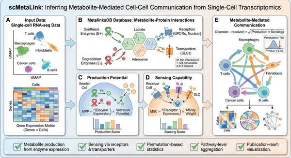
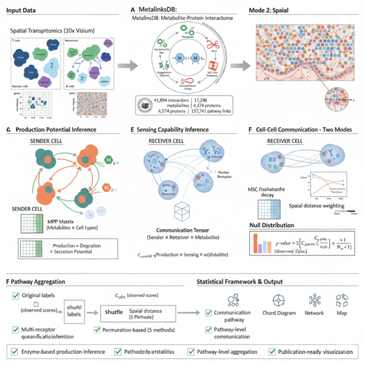
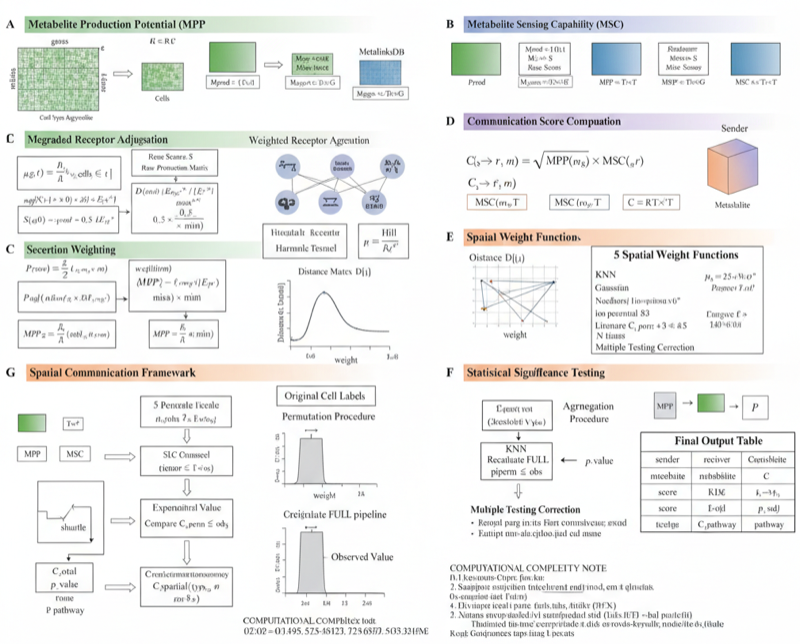

# scMetaLink

<!-- badges: start -->
[](https://github.com/Zaoqu-Liu/scMetaLink/actions/workflows/R-CMD-check.yaml)
[](https://opensource.org/licenses/MIT)
[](https://www.r-project.org/)
[](https://github.com/Zaoqu-Liu/scMetaLink)
[](https://zaoqu-liu.r-universe.dev/scMetaLink)
[](https://github.com/Zaoqu-Liu/scMetaLink/stargazers)
<!-- badges: end -->

**scMetaLink** is an R package for inferring metabolite-mediated cell-cell communication from single-cell and spatial transcriptomics data.

📖 **Documentation**: https://Zaoqu-Liu.github.io/scMetaLink/

## Background

Metabolites serve as critical signaling molecules in the cellular microenvironment. While tools like CellChat and CellPhoneDB have advanced our understanding of ligand-receptor interactions, the metabolic dimension of intercellular communication remains underexplored. scMetaLink addresses this gap by integrating enzyme expression, transporter activity, and receptor-metabolite interactions to reconstruct metabolite-mediated communication networks.

## Workflow

<p align="center">
  
</p>

## Features

- **Metabolite Production Inference**: Estimate metabolite production potential based on biosynthetic enzyme expression
- **Metabolite Sensing Analysis**: Quantify sensing capability via receptors (GPCRs, nuclear receptors) and transporters
- **Statistical Framework**: Permutation-based significance testing with multiple hypothesis correction
- **Pathway Integration**: Aggregate communication patterns at the pathway level
- **Spatial Transcriptomics**: Distance-weighted communication analysis for spatial data
- **Visualization**: Heatmaps, chord diagrams, network plots, and spatial maps

## Database

scMetaLink utilizes MetalinksDB, containing:

- 41,894 metabolite-protein interactions
- 1,128 metabolites
- 4,374 proteins/genes
- 157,741 pathway associations

## Installation

### From r-universe (Recommended)

```r
install.packages("scMetaLink", repos = "https://zaoqu-liu.r-universe.dev")
```

### From GitHub

```r
# Install devtools if needed
if (!require("devtools")) install.packages("devtools")

devtools::install_github("Zaoqu-Liu/scMetaLink")
```

## Quick Start

### Single-Cell Analysis

```r
library(scMetaLink)

# Create scMetaLink object
obj <- createScMetaLink(
  expression_data = expr_matrix,
  cell_meta = cell_metadata,
  cell_type_column = "cell_type"
)

# Infer metabolite production and sensing
obj <- inferProduction(obj)
obj <- inferSensing(obj)

# Compute communication with significance testing
obj <- computeCommunication(obj, n_permutations = 1000)
obj <- filterSignificantInteractions(obj, pvalue_threshold = 0.05)

# Visualize results
plotCommunicationHeatmap(obj)
plotCommunicationCircle(obj)
```

For Seurat users:

```r
result <- runScMetaLinkSeurat(seurat_obj, cell_type_column = "cell_type")
```

---

## Spatial Transcriptomics Analysis

scMetaLink supports **spatial transcriptomics** data with distance-weighted communication analysis.

### Spatial Workflow

<p align="center">
  
</p>

### Spatial Communication Algorithm

<p align="center">
  
</p>

### Spatial Quick Start

```r
library(scMetaLink)

# Load spatial data
data(st_expr)
data(st_meta)
data(st_scalefactors)

# Create spatial scMetaLink object
obj <- createScMetaLinkFromSpatial(
  expression_data = st_expr,
  spatial_coords = st_meta[, c("x", "y")],
  cell_meta = st_meta,
  cell_type_column = "cell_type",
  scale_factors = st_scalefactors
)

# Infer production and sensing
obj <- inferProduction(obj)
obj <- inferSensing(obj)

# Compute spatially-weighted communication
obj <- computeSpatialCommunication(
  obj,
  method = "knn",        # K-nearest neighbors (recommended for Visium)
  k_neighbors = 6,       # Hexagonal grid neighbors
  n_permutations = 1000
)

# Filter and visualize
obj <- filterSignificantInteractions(obj)
plotSpatialCellTypes(obj)
plotSpatialCommunicationNetwork(obj)
plotSpatialFeature(obj, metabolite = "L-Lactic acid", type = "production")
```

### Spatial Weighting Methods

| Method | Formula | Best for |
|:--|:--|:--|
| `knn` | K-nearest neighbors | Visium (recommended) |
| `gaussian` | exp(-d²/2σ²) | Smooth decay |
| `exponential` | exp(-d/λ) | Sharp decay |
| `threshold` | Binary cutoff | Strict distance limit |

---

## Methodology

### Metabolite Production Potential (MPP)

$$MPP(m, c) = \frac{\sum_{e \in E_m^+} w_e \cdot \text{expr}(e, c)}{|E_m^+|} \cdot S(m)$$

where $E_m^+$ denotes biosynthetic enzymes for metabolite $m$, $w_e$ is the evidence weight, and $S(m)$ represents secretion potential.

### Metabolite Sensing Capability (MSC)

$$MSC(m, c) = \sum_{r \in R_m} w_r \cdot \tau(r) \cdot \text{expr}(r, c)$$

where $R_m$ includes receptors and transporters for metabolite $m$, and $\tau(r)$ is the receptor type weight.

### Communication Score

$$C(s \rightarrow r, m) = \sqrt{MPP(m, s) \times MSC(m, r)}$$

### Spatial Communication Score

$$C_{spatial}(s \rightarrow r, m) = \sqrt{MPP(m, s) \times MSC(m, r)} \times w(d_{sr})$$

where $w(d)$ is the spatial weight function (e.g., Gaussian decay).

Statistical significance is assessed via permutation testing with FDR correction.

---

## Tutorials

| Tutorial | Description |
|:--|:--|
| [Quick Start](https://Zaoqu-Liu.github.io/scMetaLink/articles/quick-start.html) | Basic workflow |
| [Theory](https://Zaoqu-Liu.github.io/scMetaLink/articles/theory.html) | Mathematical framework |
| [Production & Sensing](https://Zaoqu-Liu.github.io/scMetaLink/articles/production-sensing.html) | Inference details |
| [Communication](https://Zaoqu-Liu.github.io/scMetaLink/articles/communication.html) | Statistical analysis |
| [Spatial Analysis](https://Zaoqu-Liu.github.io/scMetaLink/articles/spatial-analysis.html) | Spatial transcriptomics |
| [Lactate Signaling](https://Zaoqu-Liu.github.io/scMetaLink/articles/lactate-signaling.html) | Lactate-mediated communication |
| [Visualization](https://Zaoqu-Liu.github.io/scMetaLink/articles/visualization.html) | Plotting functions |
| [Applications](https://Zaoqu-Liu.github.io/scMetaLink/articles/applications.html) | Case studies |

## Citation

If you use scMetaLink in your research, please cite:

```
Liu Z, et al. (2026). scMetaLink: Inferring metabolite-mediated cell-cell 
communication from single-cell and spatial transcriptomics data.
```

## Contact

- **Author**: Zaoqu Liu
- **Email**: liuzaoqu@163.com
- **GitHub**: https://github.com/Zaoqu-Liu/scMetaLink
