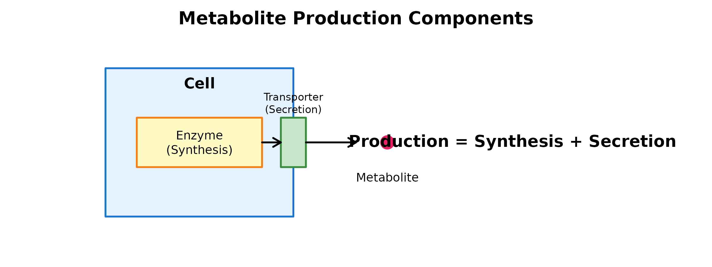

# Production & Sensing Analysis

## Overview

This tutorial provides a deep dive into the production and sensing
inference steps, explaining each parameter and showing how to interpret
the results.

``` r
library(scMetaLink)
library(Matrix)

# Load example data
data(crc_example)

# Create object
obj <- createScMetaLink(crc_expr, crc_meta, "cell_type")
```

## Part 1: Metabolite Production Potential

### Understanding Production

**Production potential** reflects a cell type’s capacity to: 1.
**Synthesize** metabolites via enzymatic reactions 2.
**Secrete/release** metabolites to the extracellular space



### The `inferProduction()` Function

``` r
obj <- inferProduction(
  obj,
  method = "combined",           # Expression scoring method
  mean_method = "arithmetic",    # Mean calculation method
  min_expression = 0,            # Minimum expression threshold
  min_pct = 0.1,                 # Minimum % of expressing cells
  consider_degradation = TRUE,   # Account for degradation enzymes
  consider_secretion = TRUE,     # Weight by extracellular localization
  normalize = TRUE,              # Normalize across cell types
  verbose = TRUE
)
```

### Parameter Deep Dive

#### 1. `method`: Expression Scoring

``` r
# Compare different scoring methods
obj_mean <- inferProduction(obj, method = "mean", verbose = FALSE)
obj_prop <- inferProduction(obj, method = "proportion", verbose = FALSE)
obj_comb <- inferProduction(obj, method = "combined", verbose = FALSE)

# Compare for lactate
lactate_id <- "HMDB0000190"
par(mfrow = c(1, 3))

if (lactate_id %in% rownames(obj_mean@production_scores)) {
  barplot(sort(obj_mean@production_scores[lactate_id, ], decreasing = TRUE),
          las = 2, main = "method = 'mean'", col = "#64B5F6", cex.names = 0.7)
  barplot(sort(obj_prop@production_scores[lactate_id, ], decreasing = TRUE),
          las = 2, main = "method = 'proportion'", col = "#81C784", cex.names = 0.7)
  barplot(sort(obj_comb@production_scores[lactate_id, ], decreasing = TRUE),
          las = 2, main = "method = 'combined'", col = "#FFB74D", cex.names = 0.7)
}
```


**Figure 1: Expression Scoring Method Comparison.** Lactate production
potential across cell types using three different scoring methods.
‘mean’ uses average expression, ‘proportion’ uses percentage of
expressing cells, and ‘combined’ multiplies both for a balanced score.

``` r
par(mfrow = c(1, 1))
```

**Recommendations**: - `combined`: Best for most cases, balances
expression level and consistency - `mean`: When you trust raw expression
values - `proportion`: When dropout is severe and you only care about
on/off

#### 2. `mean_method`: Robust Mean Calculation

For single-cell data with high dropout and outliers, **trimean**
provides robustness:

``` r
# Compare arithmetic vs trimean
obj_arith <- inferProduction(obj, mean_method = "arithmetic", verbose = FALSE)
obj_trim <- inferProduction(obj, mean_method = "trimean", verbose = FALSE)

# Correlation between methods
if (nrow(obj_arith@production_scores) > 0) {
  cor_val <- cor(as.vector(obj_arith@production_scores), 
                 as.vector(obj_trim@production_scores))
  cat("Correlation between arithmetic and trimean:", round(cor_val, 3), "\n")
}
#> Correlation between arithmetic and trimean: 0.786
```

**When to use trimean**: - High dropout rates (\>50%) - Suspected
outlier cells - When standard mean seems unstable

#### 3. `consider_degradation`: Accounting for Metabolite Turnover

When `TRUE`, production score is adjusted by subtracting degradation
enzyme expression:

$$\text{Production}_{\text{net}} = \text{Production}_{\text{raw}} - 0.5 \times \text{Degradation}$$

``` r
obj_with_deg <- inferProduction(obj, consider_degradation = TRUE, verbose = FALSE)
obj_no_deg <- inferProduction(obj, consider_degradation = FALSE, verbose = FALSE)

# See the effect
cat("With degradation adjustment:\n")
#> With degradation adjustment:
print(head(sort(obj_with_deg@production_scores["HMDB0000190", ], decreasing = TRUE)))
#>          Monocyte          Gliacyte               TAM Normal Macrophage 
#>         0.9375074         0.5305421         0.5021831         0.4832566 
#>  Tumor Epithelial Normal Epithelial 
#>         0.3845369         0.3664723
cat("\nWithout degradation adjustment:\n")
#> 
#> Without degradation adjustment:
print(head(sort(obj_no_deg@production_scores["HMDB0000190", ], decreasing = TRUE)))
#> Normal Fibroblast               CAF          Monocyte               SMC 
#>         0.6240821         0.6076395         0.5739714         0.5331675 
#>               TAM Normal Macrophage 
#>         0.5177441         0.5003088
```

#### 4. `consider_secretion`: Extracellular Localization

When `TRUE`, metabolites known to be extracellular receive full weight
(1.0), while intracellular metabolites are downweighted (0.5):

``` r
# Check extracellular metabolites
db <- scMetaLink:::.load_metalinksdb()
extra_mets <- unique(db$cell_location$hmdb[db$cell_location$cell_location == "Extracellular"])
cat("Number of extracellular metabolites:", length(extra_mets), "\n")
#> Number of extracellular metabolites: 1128
cat("Sample:", head(db$metabolites$metabolite[db$metabolites$hmdb %in% extra_mets]), "\n")
#> Sample: Sulfate Oxoglutaric acid Calcium Glycerol 17alpha-Estradiol Acetaldehyde
```

### Exploring Production Results

``` r
# Get production score matrix
prod_scores <- obj@production_scores

cat("Production score matrix dimensions:", dim(prod_scores), "\n")
#> Production score matrix dimensions: 790 15
cat("Metabolites:", nrow(prod_scores), "\n")
#> Metabolites: 790
cat("Cell types:", ncol(prod_scores), "\n")
#> Cell types: 15

# Top producing cell types for key metabolites
cat("\n=== Top Lactate Producers ===\n")
#> 
#> === Top Lactate Producers ===
print(getTopProducers(obj, "L-Lactic acid", top_n = 5))
#>           cell_type production_score rank
#> 1          Monocyte        0.9375074    1
#> 2          Gliacyte        0.5305421    2
#> 3               TAM        0.5021831    3
#> 4 Normal Macrophage        0.4832566    4
#> 5  Tumor Epithelial        0.3845369    5

cat("\n=== Top ATP Producers ===\n")
#> 
#> === Top ATP Producers ===
print(getTopProducers(obj, "Adenosine triphosphate", top_n = 5))
#>           cell_type production_score rank
#> 1               SMC        0.6306768    1
#> 2          Pericyte        0.6202034    2
#> 3               CAF        0.5758405    3
#> 4 Normal Macrophage        0.5673444    4
#> 5               TAM        0.5539278    5
```

### Visualizing Production Patterns

``` r
# Heatmap of production scores for top variable metabolites
prod_var <- apply(prod_scores, 1, var)
top_mets <- names(sort(prod_var, decreasing = TRUE))[1:30]

# Simple heatmap
heatmap(prod_scores[top_mets, ], 
        scale = "row",
        col = hcl.colors(50, "RdYlBu", rev = TRUE),
        margins = c(10, 15),
        main = "Production Potential (Top 30 Variable Metabolites)")
```


**Figure 2: Production Potential Heatmap.** Top 30 metabolites with
highest variance across cell types. Row-scaled values show relative
production potential. Clustering reveals cell types with similar
metabolic production profiles.

------------------------------------------------------------------------

## Part 2: Metabolite Sensing Capability

### Understanding Sensing

**Sensing capability** reflects a cell type’s capacity to: 1. **Detect**
metabolites via membrane receptors (GPCRs, ion channels, etc.) 2.
**Uptake** metabolites via transporters


### The `inferSensing()` Function

``` r
obj <- inferSensing(
  obj,
  method = "combined",           # Expression scoring method
  mean_method = "arithmetic",    # Mean calculation method
  min_expression = 0,            # Minimum expression threshold
  min_pct = 0.1,                 # Minimum % of expressing cells
  weight_by_affinity = TRUE,     # Weight by binding affinity
  include_transporters = TRUE,   # Include uptake transporters
  use_hill = FALSE,              # Apply Hill function transformation
  hill_n = 1,                    # Hill coefficient
  hill_Kh = 0.5,                 # Half-maximal threshold
  normalize = TRUE,
  verbose = TRUE
)
```

### Parameter Deep Dive

#### 1. `weight_by_affinity`: Binding Strength Weighting

When `TRUE`, receptors are weighted by their metabolite binding affinity
from MetalinksDB:

``` r
# Show affinity scores for a metabolite
receptors <- getMetaboliteReceptors("Adenosine", include_transporters = FALSE)
cat("Adenosine receptors with affinity scores:\n")
#> Adenosine receptors with affinity scores:
print(head(receptors, 10))
#>      gene_symbol       protein_type combined_score             metabolite
#> 3132       P2RY1               gpcr            999 Adenosine triphosphate
#> 3135        CFTR           other_ic            999 Adenosine triphosphate
#> 3104       P2RY2               gpcr            998 Adenosine triphosphate
#> 3187       P2RX1               lgic            998 Adenosine triphosphate
#> 3144       P2RX4               lgic            997 Adenosine triphosphate
#> 3150       ABCC8        transporter            997 Adenosine triphosphate
#> 3218      KCNJ11               vgic            995 Adenosine triphosphate
#> 3203       P2RX2               lgic            994 Adenosine triphosphate
#> 3209       ABCB1        transporter            994 Adenosine triphosphate
#> 3119        EGFR catalytic_receptor            988 Adenosine triphosphate
```

#### 2. `include_transporters`: Uptake Transporters

``` r
# Compare with and without transporters
obj_with_trans <- inferSensing(obj, include_transporters = TRUE, verbose = FALSE)
obj_no_trans <- inferSensing(obj, include_transporters = FALSE, verbose = FALSE)

cat("Metabolites detected:\n")
#> Metabolites detected:
cat("  With transporters:", nrow(obj_with_trans@sensing_scores), "\n")
#>   With transporters: 496
cat("  Without transporters:", nrow(obj_no_trans@sensing_scores), "\n")
#>   Without transporters: 385
```

**When to exclude transporters**: If you only want receptor-mediated
signaling (not metabolic uptake).

#### 3. `use_hill`: Receptor Saturation Model

The Hill function models receptor binding saturation:

``` r
# Compare linear vs Hill transformation
obj_linear <- inferSensing(obj, use_hill = FALSE, verbose = FALSE)
obj_hill <- inferSensing(obj, use_hill = TRUE, hill_n = 1, hill_Kh = 0.5, verbose = FALSE)

par(mfrow = c(1, 2))

# Find a common metabolite
common_met <- intersect(rownames(obj_linear@sensing_scores), 
                        rownames(obj_hill@sensing_scores))[1]

if (!is.na(common_met)) {
  plot(obj_linear@sensing_scores[common_met, ],
       obj_hill@sensing_scores[common_met, ],
       xlab = "Linear Sensing Score",
       ylab = "Hill-transformed Score",
       main = paste("Effect of Hill Function on", common_met),
       pch = 19, col = "#1976D2")
  abline(0, 1, lty = 2, col = "gray")
}

# Hill parameter comparison
x <- seq(0, 1, 0.01)
plot(x, x, type = "l", lty = 2, col = "gray",
     xlab = "Expression", ylab = "Sensing Score",
     main = "Hill Function Parameters")
lines(x, x^1 / (0.3^1 + x^1), col = "blue", lwd = 2)
lines(x, x^1 / (0.5^1 + x^1), col = "red", lwd = 2)
lines(x, x^1 / (0.7^1 + x^1), col = "green", lwd = 2)
legend("bottomright", 
       legend = c("Linear", "Kh=0.3", "Kh=0.5", "Kh=0.7"),
       col = c("gray", "blue", "red", "green"),
       lty = c(2, 1, 1, 1), lwd = 2)
```


**Figure 3: Hill Function Effect on Sensing Scores.** Left: Comparison
of linear vs Hill-transformed sensing scores for a metabolite. Points
below the diagonal indicate saturation at high expression levels. Right:
Different Kh values affect when saturation begins - lower Kh means
earlier saturation.

``` r
par(mfrow = c(1, 1))
```

**When to use Hill function**: - You expect receptor saturation at high
expression - Modeling dose-response relationships - Biological realism
is important

### Exploring Sensing Results

``` r
sens_scores <- obj@sensing_scores

cat("Sensing score matrix dimensions:", dim(sens_scores), "\n")
#> Sensing score matrix dimensions: 496 15

# Top sensing cell types
cat("\n=== Top Glutamate Sensors ===\n")
#> 
#> === Top Glutamate Sensors ===
print(getTopSensors(obj, "L-Glutamic acid", top_n = 5))
#>           cell_type sensing_score rank
#> 1 Normal Macrophage     0.7624215    1
#> 2               TAM     0.6192208    2
#> 3  Tumor Epithelial     0.4362282    3
#> 4          Gliacyte     0.4255517    4
#> 5 Normal Fibroblast     0.4229089    5

cat("\n=== Top Adenosine Sensors ===\n")
#> 
#> === Top Adenosine Sensors ===
print(getTopSensors(obj, "Adenosine", top_n = 5))
#>           cell_type sensing_score rank
#> 1 Normal Macrophage     0.6479570    1
#> 2               TAM     0.5871354    2
#> 3          Pericyte     0.5663821    3
#> 4 Normal Fibroblast     0.4805927    4
#> 5               CAF     0.4760286    5
```

### Receptor Analysis for a Metabolite

``` r
# Get all receptors for a metabolite
cat("=== Serotonin (5-HT) Receptors ===\n")
#> === Serotonin (5-HT) Receptors ===
serotonin_receptors <- getMetaboliteReceptors("Serotonin", include_transporters = TRUE)
print(serotonin_receptors)
#>      gene_symbol protein_type combined_score metabolite
#> 2284        HTR7         gpcr            999  Serotonin
#> 2383       HTR1A         gpcr            999  Serotonin
#> 2287       HTR1B         gpcr            998  Serotonin
#> 2332       HTR2C         gpcr            998  Serotonin
#> 2385       HTR2B         gpcr            997  Serotonin
#> 2271        HTR4         gpcr            990  Serotonin
#> 2304        DRD2         gpcr            989  Serotonin
#> 2333        HTR6         gpcr            987  Serotonin
#> 2398       HTR1E         gpcr            987  Serotonin
#> 2273       HTR1F         gpcr            985  Serotonin
#> 2326       HTR5A         gpcr            973  Serotonin
#> 2359        DRD3         gpcr            964  Serotonin
#> 2484      TBXA2R         gpcr            956  Serotonin
#> 2265        DRD4         gpcr            950  Serotonin
#> 2356       OPRM1         gpcr            948  Serotonin
#> 2386       OPRD1         gpcr            940  Serotonin
#> 2267        DRD5         gpcr            939  Serotonin
#> 2264       PPARG          nhr            938  Serotonin
#> 2350       NTSR1         gpcr            938  Serotonin
#> 2502       NTSR2         gpcr            938  Serotonin
#> 2354      ADRA2A         gpcr            937  Serotonin
#> 2519        CNR1         gpcr            937  Serotonin
#> 2390        OPN4         gpcr            936  Serotonin
#> 2401        HRH2         gpcr            936  Serotonin
#> 2416       MCHR1         gpcr            936  Serotonin
#> 2458        MC1R         gpcr            935  Serotonin
#> 2286      NPBWR2         gpcr            934  Serotonin
#> 2374      ADRA1A         gpcr            934  Serotonin
#> 2437      ADRA2C         gpcr            934  Serotonin
#> 2516       TAAR1         gpcr            933  Serotonin
#> 2266       NMUR2         gpcr            928  Serotonin
#> 2269       ADRB1         gpcr            928  Serotonin
#> 2270       ADRB2         gpcr            928  Serotonin
#> 2276      LTB4R2         gpcr            928  Serotonin
#> 2280       UTS2R         gpcr            928  Serotonin
#> 2285       GNRHR         gpcr            928  Serotonin
#> 2290       SSTR4         gpcr            928  Serotonin
#> 2293        CCR3         gpcr            928  Serotonin
#> 2297       OPRK1         gpcr            928  Serotonin
#> 2298        HRH4         gpcr            928  Serotonin
#> 2299      PTGER1         gpcr            928  Serotonin
#> 2303       AVPR2         gpcr            928  Serotonin
#> 2307        CCR5         gpcr            928  Serotonin
#> 2310        CCR4         gpcr            928  Serotonin
#> 2311       ACKR3         gpcr            928  Serotonin
#> 2314       EDNRA         gpcr            928  Serotonin
#> 2317      BDKRB1         gpcr            928  Serotonin
#> 2318     ADORA2A         gpcr            928  Serotonin
#> 2321       GALR3         gpcr            928  Serotonin
#> 2325        GHSR         gpcr            928  Serotonin
#> 2328       AGTR2         gpcr            928  Serotonin
#> 2329        MLNR         gpcr            928  Serotonin
#> 2330       CXCR4         gpcr            928  Serotonin
#> 2338        GRPR         gpcr            928  Serotonin
#> 2340      ADRA1D         gpcr            928  Serotonin
#> 2341      PTGER3         gpcr            928  Serotonin
#> 2343     ADORA2B         gpcr            928  Serotonin
#> 2348      NPFFR2         gpcr            928  Serotonin
#> 2351      ADRA1B         gpcr            928  Serotonin
#> 2352      NPFFR1         gpcr            928  Serotonin
#> 2355       SSTR1         gpcr            928  Serotonin
#> 2358       SSTR2         gpcr            928  Serotonin
#> 2362       LTB4R         gpcr            928  Serotonin
#> 2363      HCRTR2         gpcr            928  Serotonin
#> 2364       LPAR1         gpcr            928  Serotonin
#> 2366       PTGFR         gpcr            928  Serotonin
#> 2368      PROKR1         gpcr            928  Serotonin
#> 2372       CCKBR         gpcr            928  Serotonin
#> 2378        MC5R         gpcr            928  Serotonin
#> 2380        MC2R         gpcr            928  Serotonin
#> 2384      PTGER2         gpcr            928  Serotonin
#> 2391      ADORA1         gpcr            928  Serotonin
#> 2393       NMUR1         gpcr            928  Serotonin
#> 2396       RXFP4         gpcr            928  Serotonin
#> 2403      HCRTR1         gpcr            928  Serotonin
#> 2405       SSTR5         gpcr            928  Serotonin
#> 2407       GALR2         gpcr            928  Serotonin
#> 2415       PTGDR         gpcr            928  Serotonin
#> 2419       AGTR1         gpcr            928  Serotonin
#> 2422       NPY2R         gpcr            928  Serotonin
#> 2425       LPAR2         gpcr            928  Serotonin
#> 2427       MCHR2         gpcr            928  Serotonin
#> 2429        CCR9         gpcr            928  Serotonin
#> 2431       NPY5R         gpcr            928  Serotonin
#> 2434       NPSR1         gpcr            928  Serotonin
#> 2436       OPRL1         gpcr            928  Serotonin
#> 2439       APLNR         gpcr            928  Serotonin
#> 2441       QRFPR         gpcr            928  Serotonin
#> 2442       RXFP3         gpcr            928  Serotonin
#> 2443       LPAR3         gpcr            928  Serotonin
#> 2447       CCKAR         gpcr            928  Serotonin
#> 2449       GALR1         gpcr            928  Serotonin
#> 2452       ADRB3         gpcr            928  Serotonin
#> 2454        MC4R         gpcr            928  Serotonin
#> 2460        OXTR         gpcr            928  Serotonin
#> 2465        MC3R         gpcr            928  Serotonin
#> 2467        CCR1         gpcr            928  Serotonin
#> 2470      PROKR2         gpcr            928  Serotonin
#> 2474      KISS1R         gpcr            928  Serotonin
#> 2479       PTGIR         gpcr            928  Serotonin
#> 2483        NMBR         gpcr            928  Serotonin
#> 2485      AVPR1A         gpcr            928  Serotonin
#> 2492        CNR2         gpcr            928  Serotonin
#> 2496        TRHR         gpcr            928  Serotonin
#> 2497      PTGER4         gpcr            928  Serotonin
#> 2503       GPR65         gpcr            928  Serotonin
#> 2507       CXCR6         gpcr            928  Serotonin
#> 2515       NPY1R         gpcr            928  Serotonin
#> 2524       NPY4R         gpcr            928  Serotonin
#> 2530       EDNRB         gpcr            928  Serotonin
#> 2531        HRH3         gpcr            928  Serotonin
#> 2370      GPR119         gpcr            393  Serotonin
#> 2466         RHO         gpcr            375  Serotonin
#> 2279       GPR39         gpcr            373  Serotonin
#> 2347       FFAR4         gpcr            373  Serotonin
#> 2305       GPR62         gpcr            367  Serotonin
#> 2459        OPN5         gpcr            360  Serotonin
#> 2272       GPR27         gpcr            310  Serotonin
#> 2274       GPR19         gpcr            310  Serotonin
#> 2277      GPR176         gpcr            310  Serotonin
#> 2278       GPR61         gpcr            310  Serotonin
#> 2281       TAAR5         gpcr            310  Serotonin
#> 2296       GPR52         gpcr            310  Serotonin
#> 2312      GPR139         gpcr            310  Serotonin
#> 2315      GPR173         gpcr            310  Serotonin
#> 2322       GPR83         gpcr            310  Serotonin
#> 2323       GPR63         gpcr            310  Serotonin
#> 2336        BRS3         gpcr            310  Serotonin
#> 2344      OPN1LW         gpcr            310  Serotonin
#> 2357      AVPR1B         gpcr            310  Serotonin
#> 2360     GPR37L1         gpcr            310  Serotonin
#> 2367       PRLHR         gpcr            310  Serotonin
#> 2377      GPR142         gpcr            310  Serotonin
#> 2379       GPR45         gpcr            310  Serotonin
#> 2381       GPR26         gpcr            310  Serotonin
#> 2394      OPN1SW         gpcr            310  Serotonin
#> 2397       GPR85         gpcr            310  Serotonin
#> 2408       TAAR2         gpcr            310  Serotonin
#> 2410      GPR151         gpcr            310  Serotonin
#> 2420      GPR148         gpcr            310  Serotonin
#> 2433        GPR3         gpcr            310  Serotonin
#> 2450       GPR78         gpcr            310  Serotonin
#> 2451       TAAR8         gpcr            310  Serotonin
#> 2463      GPR150         gpcr            310  Serotonin
#> 2488       GPR22         gpcr            310  Serotonin
#> 2489       GPR12         gpcr            310  Serotonin
#> 2490      GPR135         gpcr            310  Serotonin
#> 2498        OPN3         gpcr            310  Serotonin
#> 2501       GPR88         gpcr            310  Serotonin
#> 2504        GPR6         gpcr            310  Serotonin
#> 2513       TAAR6         gpcr            310  Serotonin
#> 2521       GPR84         gpcr            310  Serotonin
#> 2532       GPR37         gpcr            310  Serotonin
#> 2282       HTR3B         lgic             NA  Serotonin
#> 2283     SLC36A1  transporter             NA  Serotonin
#> 2292       HTR1D         gpcr             NA  Serotonin
#> 2295        DRD1         gpcr             NA  Serotonin
#> 2402     CYSLTR1         gpcr             NA  Serotonin
#> 2468      SLC6A4  transporter             NA  Serotonin
#> 2493       HTR3A         lgic             NA  Serotonin
#> 2506       HTR2A         gpcr             NA  Serotonin
```

------------------------------------------------------------------------

## Part 3: Comparing Production and Sensing

### Which Cell Types are Producers vs Sensors?

``` r
# Get common metabolites
common_mets <- intersect(rownames(obj@production_scores), 
                         rownames(obj@sensing_scores))

if (length(common_mets) > 0) {
  # Average production and sensing per cell type
  avg_prod <- colMeans(obj@production_scores[common_mets, ])
  avg_sens <- colMeans(obj@sensing_scores[common_mets, ])
  
  plot(avg_prod, avg_sens,
       xlab = "Average Production Potential",
       ylab = "Average Sensing Capability",
       main = "Cell Type Metabolic Roles",
       pch = 19, cex = 1.5, col = "#1976D2")
  text(avg_prod, avg_sens, names(avg_prod), pos = 3, cex = 0.7)
  abline(0, 1, lty = 2, col = "gray")
  
  # Annotate quadrants
  text(max(avg_prod) * 0.9, max(avg_sens) * 0.1, "High Production\nLow Sensing", 
       cex = 0.8, col = "gray40")
  text(max(avg_prod) * 0.1, max(avg_sens) * 0.9, "Low Production\nHigh Sensing", 
       cex = 0.8, col = "gray40")
}
```


**Figure 4: Cell Type Metabolic Roles.** Scatter plot comparing average
production potential (x-axis) vs sensing capability (y-axis) for each
cell type. Cell types above the diagonal are net sensors; those below
are net producers.

### Metabolite-Specific Roles

``` r
# For a specific metabolite, which cells produce vs sense?
met_name <- "L-Lactic acid"
met_id <- "HMDB0000190"

if (met_id %in% rownames(obj@production_scores) && 
    met_id %in% rownames(obj@sensing_scores)) {
  
  prod <- obj@production_scores[met_id, ]
  sens <- obj@sensing_scores[met_id, ]
  
  par(mfrow = c(1, 2))
  barplot(sort(prod, decreasing = TRUE), las = 2,
          main = paste(met_name, "- Production"),
          col = "#FF7043", cex.names = 0.7)
  barplot(sort(sens, decreasing = TRUE), las = 2,
          main = paste(met_name, "- Sensing"),
          col = "#42A5F5", cex.names = 0.7)
  par(mfrow = c(1, 1))
}
```


**Figure 5: Metabolite-Specific Production and Sensing.** Comparison of
lactate production (left, orange) and sensing (right, blue) across cell
types. This reveals the communication axis: producers release lactate
that sensors can detect or uptake.

## Summary

| Step           | Key Parameters                                           | Output                      |
|----------------|----------------------------------------------------------|-----------------------------|
| **Production** | `method`, `mean_method`, `consider_degradation`          | `@production_scores` matrix |
| **Sensing**    | `weight_by_affinity`, `include_transporters`, `use_hill` | `@sensing_scores` matrix    |

## Next Steps

- **[Communication
  Analysis](https://Zaoqu-Liu.github.io/scMetaLink/articles/04-communication.md)**:
  How to combine production and sensing
- **[Visualization](https://Zaoqu-Liu.github.io/scMetaLink/articles/05-visualization.md)**:
  Advanced plotting options
