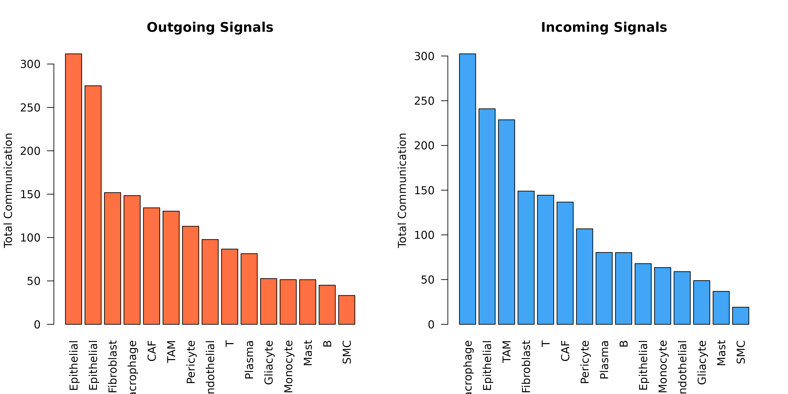
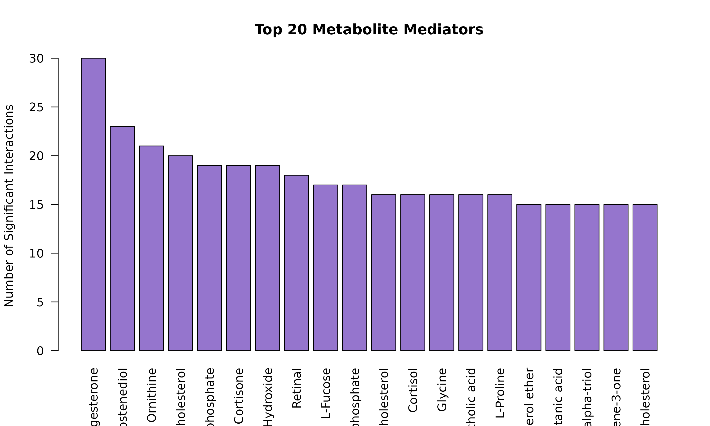
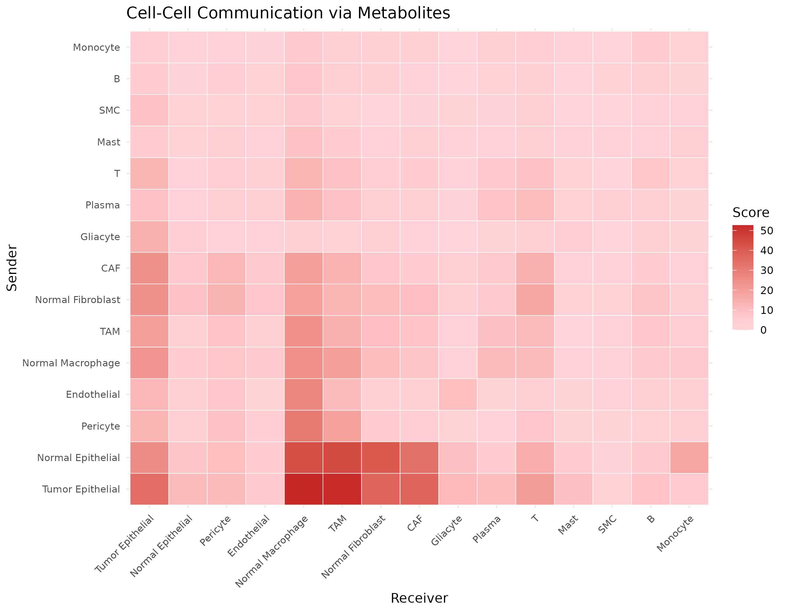

# Visualization Gallery

## Setup

``` r
library(scMetaLink)
library(Matrix)

# Run complete analysis
data(crc_example)
obj <- createScMetaLink(crc_expr, crc_meta, "cell_type")
obj <- inferProduction(obj, verbose = FALSE)
obj <- inferSensing(obj, verbose = FALSE)
obj <- computeCommunication(obj, n_permutations = 100, verbose = FALSE)
obj <- filterSignificantInteractions(obj, adjust_method = "none")  # For demo
```

## 1. Communication Heatmap

The heatmap shows communication strength between cell type pairs, with
rows representing sender cells and columns representing receiver cells.

### Basic Heatmap

``` r
plotCommunicationHeatmap(obj)
```


**Figure 1: Basic Communication Heatmap.** Pairwise communication scores
aggregated across all significant metabolite interactions. Darker colors
indicate stronger communication potential.

### Customized Heatmap

``` r
plotCommunicationHeatmap(
  obj,
  cluster_rows = TRUE,           # Cluster senders
  cluster_cols = TRUE,           # Cluster receivers
  show_values = FALSE            # Show score values
)
```


**Figure 2: Customized Heatmap with Clustering.** Hierarchical
clustering reveals cell type groups with similar communication patterns.

### Metabolite-Specific Heatmap

``` r
# Create heatmap for specific metabolites
sig <- obj@significant_interactions
lactate_sig <- sig[sig$metabolite_name == "L-Lactic acid", ]

if (nrow(lactate_sig) > 0) {
  # Build matrix
  cell_types <- unique(c(lactate_sig$sender, lactate_sig$receiver))
  mat <- matrix(0, length(cell_types), length(cell_types),
                dimnames = list(cell_types, cell_types))
  for (i in 1:nrow(lactate_sig)) {
    mat[lactate_sig$sender[i], lactate_sig$receiver[i]] <- lactate_sig$communication_score[i]
  }
  
  heatmap(mat, col = hcl.colors(50, "Reds"), scale = "none",
          main = "Lactate-Mediated Communication")
}
```


## 2. Chord Diagram (Circle Plot)

Chord diagrams elegantly show the flow of communication between cell
types. The width of each ribbon represents the strength of
communication.

### Basic Chord

``` r
plotCommunicationCircle(obj)
```


**Figure 3: Communication Chord Diagram.** Ribbons connect sender to
receiver cell types. Ribbon width is proportional to communication
strength, and colors represent the sender cell type.

### Customized Chord

``` r
plotCommunicationCircle(
  obj,
  top_n = 30,                    # Top interactions
  transparency = 0.4,            # Link opacity (0-1)
  title = "Top 30 Metabolic Communications"
)
```


**Figure 4: Customized Chord Diagram.** Enhanced visualization with
adjusted transparency showing top 30 interactions.

## 3. Network Visualization

Network plots show communication as a graph structure.

### Basic Network

``` r
plotCommunicationNetwork(obj)
```


### Customized Network

``` r
plotCommunicationNetwork(
  obj,
  layout = "circle",             # Layout algorithm: "fr", "circle", "kk", etc.
  node_size_by = "degree",       # Size by: "degree" or "centrality"
  edge_width_scale = 3,          # Scale factor for edge widths
  min_score = 0.1                # Minimum score threshold
)
```


## 4. Metabolite Profile Visualization

Visualize production and sensing profiles for specific metabolites.

### Single Metabolite Profile

``` r
# Find a metabolite that exists in the data
sig <- obj@significant_interactions
if (nrow(sig) > 0) {
  top_met <- names(sort(table(sig$metabolite_name), decreasing = TRUE))[1]
  plotMetaboliteProfile(obj, metabolite = top_met)
}
```


**Figure 5: Metabolite Profile.** Production (left) and sensing (right)
scores across cell types for a specific metabolite.

### Production vs Sensing Comparison

``` r
# Compare profiles for multiple metabolites
par(mfrow = c(2, 2))
top_mets <- names(sort(table(sig$metabolite_name), decreasing = TRUE))[1:4]
for (met in top_mets) {
  tryCatch({
    plotMetaboliteProfile(obj, metabolite = met)
    title(sub = met)
  }, error = function(e) {
    plot.new()
    text(0.5, 0.5, paste(met, "\nNot found"), cex = 1.2)
  })
}
par(mfrow = c(1, 1))
```

## 5. Production-Sensing Comparison

### Cell Type Roles: Producers vs Sensors

``` r
# Get common metabolites
prod_scores <- obj@production_scores
sens_scores <- obj@sensing_scores
common_mets <- intersect(rownames(prod_scores), rownames(sens_scores))

if (length(common_mets) > 0) {
  avg_prod <- colMeans(prod_scores[common_mets, ])
  avg_sens <- colMeans(sens_scores[common_mets, ])
  
  plot(avg_prod, avg_sens,
       xlab = "Average Production Potential",
       ylab = "Average Sensing Capability",
       main = "Cell Type Metabolic Roles",
       pch = 19, cex = 1.5, col = "#1976D2")
  text(avg_prod, avg_sens, names(avg_prod), pos = 3, cex = 0.7)
  abline(0, 1, lty = 2, col = "gray")
}
```


**Figure 6: Cell Type Metabolic Roles.** Each point represents a cell
type. Position shows average production (x-axis) vs sensing (y-axis)
potential. Cell types above the diagonal are net sensors; those below
are net producers.

### Specific Metabolite: Production vs Sensing

``` r
# Compare for a specific metabolite
lactate_id <- "HMDB0000190"

if (lactate_id %in% rownames(prod_scores) && lactate_id %in% rownames(sens_scores)) {
  prod <- prod_scores[lactate_id, ]
  sens <- sens_scores[lactate_id, ]
  
  par(mfrow = c(1, 2))
  barplot(sort(prod, decreasing = TRUE), las = 2, col = "#FF7043",
          main = "Lactate Production", ylab = "Score", cex.names = 0.7)
  barplot(sort(sens, decreasing = TRUE), las = 2, col = "#42A5F5",
          main = "Lactate Sensing", ylab = "Score", cex.names = 0.7)
  par(mfrow = c(1, 1))
}
```


**Figure 7: Lactate Production and Sensing.** Comparison of lactate
production (orange) vs sensing (blue) across cell types, revealing the
communication axis.

## 6. Summary Statistics Plots

### Cell Type Communication Summary

``` r
sig <- obj@significant_interactions

par(mfrow = c(1, 2))

# Outgoing
outgoing <- aggregate(communication_score ~ sender, data = sig, FUN = sum)
outgoing <- outgoing[order(-outgoing$communication_score), ]
barplot(outgoing$communication_score, names.arg = outgoing$sender,
        las = 2, col = "#FF7043", main = "Outgoing Signals",
        ylab = "Total Communication")

# Incoming
incoming <- aggregate(communication_score ~ receiver, data = sig, FUN = sum)
incoming <- incoming[order(-incoming$communication_score), ]
barplot(incoming$communication_score, names.arg = incoming$receiver,
        las = 2, col = "#42A5F5", main = "Incoming Signals",
        ylab = "Total Communication")
```



``` r

par(mfrow = c(1, 1))
```

### Metabolite Distribution

``` r
met_counts <- table(sig$metabolite_name)
met_counts <- sort(met_counts, decreasing = TRUE)

barplot(head(met_counts, 20), las = 2, col = "#9575CD",
        main = "Top 20 Metabolite Mediators",
        ylab = "Number of Significant Interactions")
```



## 7. Custom Visualizations

### Communication Matrix with ggplot2

``` r
library(ggplot2)

# Get communication matrix
comm_mat <- getCommunicationMatrix(obj, aggregate_method = "sum")

# Convert to long format
comm_df <- reshape2::melt(comm_mat)
names(comm_df) <- c("Sender", "Receiver", "Score")

ggplot(comm_df, aes(x = Receiver, y = Sender, fill = Score)) +
  geom_tile(color = "white") +
  scale_fill_gradient2(low = "white", mid = "#FFCDD2", high = "#C62828",
                       midpoint = median(comm_df$Score[comm_df$Score > 0])) +
  theme_minimal() +
  theme(axis.text.x = element_text(angle = 45, hjust = 1, size = 8),
        axis.text.y = element_text(size = 8)) +
  labs(title = "Cell-Cell Communication via Metabolites",
       fill = "Score")
```



### Interaction Dot Plot

``` r
# Top interactions as dot plot
top_int <- head(sig[order(-sig$communication_score), ], 30)
top_int$interaction <- paste(top_int$sender, "->", top_int$receiver)

ggplot(top_int, aes(x = metabolite_name, y = interaction)) +
  geom_point(aes(size = communication_score, color = -log10(pvalue_adjusted))) +
  scale_color_gradient(low = "gray70", high = "red") +
  scale_size_continuous(range = c(2, 8)) +
  theme_minimal() +
  theme(axis.text.x = element_text(angle = 45, hjust = 1, size = 8),
        axis.text.y = element_text(size = 8)) +
  labs(title = "Top Metabolite-Mediated Interactions",
       x = "Metabolite", y = "Sender -> Receiver",
       size = "Score", color = "-log10(p)")
```


## 8. Publication-Ready Figures

### Combined Figure Panel

``` r
layout(matrix(c(1, 1, 2, 3, 3, 4), nrow = 2, byrow = TRUE),
       widths = c(2, 2, 2), heights = c(1, 1))

# Panel A: Heatmap
comm_mat <- getCommunicationMatrix(obj)
heatmap(comm_mat, col = hcl.colors(50, "Reds"), scale = "none",
        main = "A. Communication Heatmap", margins = c(8, 8))
```


``` r

# Panel B: Top metabolites
par(mar = c(8, 4, 4, 2))
met_counts <- head(sort(table(sig$metabolite_name), decreasing = TRUE), 10)
barplot(met_counts, las = 2, col = "#7E57C2",
        main = "B. Top Metabolites")

# Panel C: Chord
par(mar = c(2, 2, 4, 2))
plotCommunicationCircle(obj, top_n = 20, title = "C. Communication Network")

# Panel D: Sender/Receiver summary
par(mar = c(8, 4, 4, 2))
net_flow <- sapply(unique(c(sig$sender, sig$receiver)), function(ct) {
  sum(sig$communication_score[sig$sender == ct]) - 
  sum(sig$communication_score[sig$receiver == ct])
})
net_flow <- sort(net_flow)
cols <- ifelse(net_flow > 0, "#FF7043", "#42A5F5")
barplot(net_flow, col = cols, las = 2, main = "D. Net Communication Flow")
abline(h = 0)
```


## 9. Exporting Figures

``` r
# Save as PDF
pdf("communication_heatmap.pdf", width = 10, height = 8)
plotCommunicationHeatmap(obj)
dev.off()

# Save as PNG (high resolution)
png("communication_chord.png", width = 3000, height = 3000, res = 300)
plotCommunicationCircle(obj)
dev.off()

# Save as SVG (vector format)
svg("communication_network.svg", width = 10, height = 8)
plotCommunicationNetwork(obj)
dev.off()
```

## Color Palettes Reference

``` r
# Available color palettes
palettes <- c("RdYlBu", "Reds", "Blues", "Greens", "YlOrRd", "PuBuGn", "Spectral")

par(mfrow = c(1, length(palettes)))
for (pal in palettes) {
  image(matrix(1:50, nrow = 1), col = hcl.colors(50, pal),
        axes = FALSE, main = pal)
}
```


``` r
par(mfrow = c(1, 1))
```

## Next Steps

- **[Applications](https://Zaoqu-Liu.github.io/scMetaLink/articles/06-applications.md)**:
  Real-world analysis examples
- Explore parameter tuning for optimal visualizations
