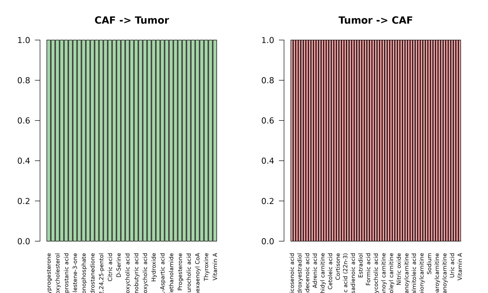
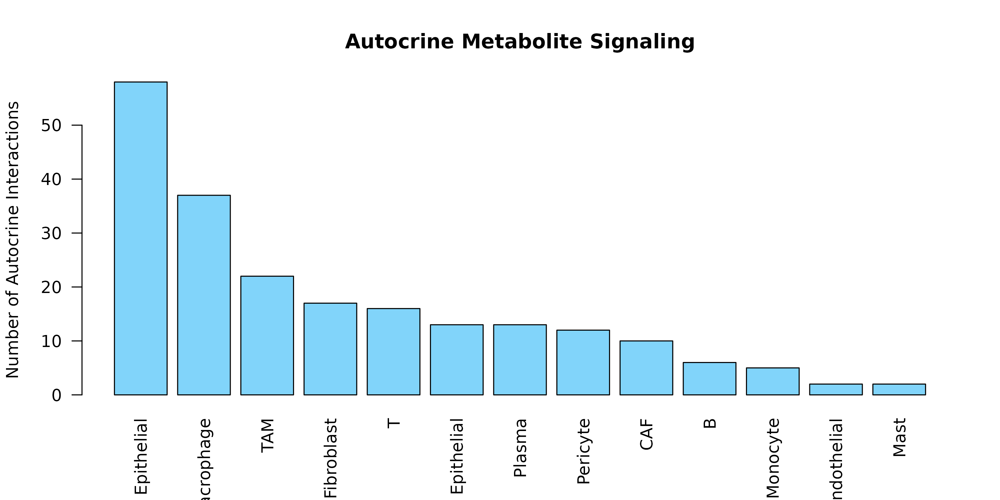
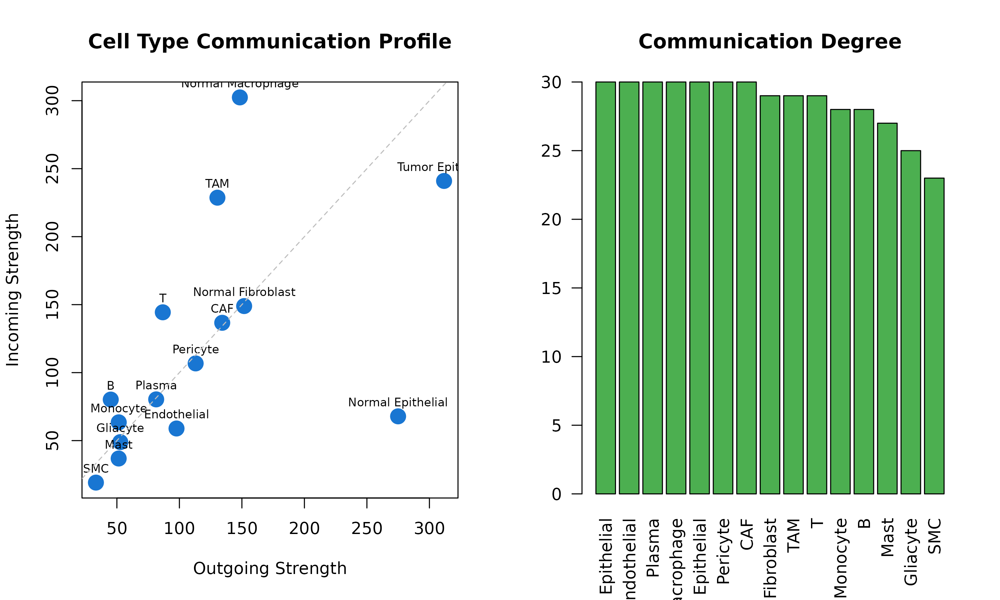

# Application Examples

## Overview

This tutorial demonstrates practical applications of scMetaLink using
the colorectal cancer (CRC) example dataset. We’ll explore:

1.  Tumor metabolism and communication
2.  Immune cell metabolic interactions
3.  Stromal-epithelial crosstalk
4.  Pathway-level analysis
5.  Hypothesis generation

``` r
library(scMetaLink)
library(Matrix)

# Load data and run full analysis
data(crc_example)

# Check cell types available
cat("Cell types in CRC dataset:\n")
#> Cell types in CRC dataset:
print(table(crc_meta$cell_type))
#> 
#>                 B               CAF       Endothelial          Gliacyte 
#>               150               200               100                20 
#>              Mast          Monocyte Normal Epithelial Normal Fibroblast 
#>                30               120               300               200 
#> Normal Macrophage          Pericyte            Plasma               SMC 
#>               150                50               250                30 
#>                 T               TAM  Tumor Epithelial 
#>               500               150               600
```

## Application 1: Tumor Metabolic Communication

### Question: How do tumor cells communicate with their microenvironment?

``` r
# Run scMetaLink
obj <- createScMetaLink(crc_expr, crc_meta, "cell_type")
obj <- inferProduction(obj, verbose = FALSE)
obj <- inferSensing(obj, verbose = FALSE)
obj <- computeCommunication(obj, n_permutations = 100, verbose = FALSE)
obj <- filterSignificantInteractions(obj, adjust_method = "none") # For demo

# Get significant interactions
sig <- obj@significant_interactions

# Filter for tumor as sender or receiver
tumor_types <- c("Tumor Epithelial")
tumor_sender <- sig[sig$sender %in% tumor_types, ]
tumor_receiver <- sig[sig$receiver %in% tumor_types, ]

cat("Interactions with tumor cells:\n")
#> Interactions with tumor cells:
cat("  As sender:", nrow(tumor_sender), "\n")
#>   As sender: 497
cat("  As receiver:", nrow(tumor_receiver), "\n")
#>   As receiver: 391
```

### Tumor Outgoing Signals

``` r
if (nrow(tumor_sender) > 0) {
  # What metabolites do tumors secrete?
  tumor_secreted <- table(tumor_sender$metabolite_name)
  tumor_secreted <- sort(tumor_secreted, decreasing = TRUE)

  par(mar = c(10, 4, 4, 2))
  barplot(head(tumor_secreted, 15),
    las = 2, col = "#E57373",
    main = "Metabolites Secreted by Tumor Cells",
    ylab = "Number of Target Cell Types"
  )
}
```


**Figure 1: Tumor-Secreted Metabolites.** Bar plot showing the top
metabolites produced by tumor cells and the number of different cell
types that sense each metabolite.

### Tumor Incoming Signals

``` r
if (nrow(tumor_receiver) > 0) {
  # What metabolites do tumors sense?
  tumor_sensed <- table(tumor_receiver$metabolite_name)
  tumor_sensed <- sort(tumor_sensed, decreasing = TRUE)

  par(mar = c(10, 4, 4, 2))
  barplot(head(tumor_sensed, 15),
    las = 2, col = "#64B5F6",
    main = "Metabolites Sensed by Tumor Cells",
    ylab = "Number of Source Cell Types"
  )
}
```


**Figure 1b: Tumor-Sensed Metabolites.** Top metabolites detected or
taken up by tumor cells. These metabolites may provide nutrients or
signaling molecules that support tumor growth.

### The Warburg Effect: Lactate Signaling

Lactate is a hallmark metabolite of the Warburg effect in cancer
metabolism. Tumor cells produce excess lactate even in the presence of
oxygen.

``` r
# Lactate is a hallmark of tumor metabolism (Warburg effect)
lactate_sig <- sig[sig$metabolite_name == "L-Lactic acid", ]

if (nrow(lactate_sig) > 0) {
  cat("Lactate-mediated interactions:", nrow(lactate_sig), "\n\n")

  # Who produces lactate?
  lactate_prod <- aggregate(communication_score ~ sender, data = lactate_sig, FUN = sum)
  lactate_prod <- lactate_prod[order(-lactate_prod$communication_score), ]

  # Who senses lactate?
  lactate_sens <- aggregate(communication_score ~ receiver, data = lactate_sig, FUN = sum)
  lactate_sens <- lactate_sens[order(-lactate_sens$communication_score), ]

  par(mfrow = c(1, 2))
  barplot(lactate_prod$communication_score,
    names.arg = lactate_prod$sender,
    las = 2, col = "#FF8A65", main = "Lactate Producers"
  )
  barplot(lactate_sens$communication_score,
    names.arg = lactate_sens$receiver,
    las = 2, col = "#4FC3F7", main = "Lactate Sensors"
  )
  par(mfrow = c(1, 1))
}
#> Lactate-mediated interactions: 3
```


**Figure 2: Lactate-Mediated Communication (Warburg Effect).** Left:
Cell types that produce lactate. Right: Cell types that sense/uptake
lactate. Tumor cells are typically major producers, while immune cells
are important sensors.

**Biological Insight**: Tumor cells often produce high levels of lactate
even in the presence of oxygen (Warburg effect). This lactate can
modulate immune cell function and promote tumor progression.

------------------------------------------------------------------------

## Application 2: Immune Cell Metabolic Interactions

### Question: How do immune cells communicate via metabolites?

``` r
# Define immune cell types
immune_types <- c("T", "B", "Plasma", "TAM", "Monocyte", "Normal Macrophage", "Mast")

# Filter for immune-immune interactions
immune_sig <- sig[sig$sender %in% immune_types & sig$receiver %in% immune_types, ]
cat("Immune-immune interactions:", nrow(immune_sig), "\n")
#> Immune-immune interactions: 531
```

### Immune Communication Network

``` r
if (nrow(immune_sig) > 0) {
  # Build communication matrix for immune cells
  immune_cells <- unique(c(immune_sig$sender, immune_sig$receiver))
  immune_mat <- matrix(0, length(immune_cells), length(immune_cells),
    dimnames = list(immune_cells, immune_cells)
  )

  for (i in 1:nrow(immune_sig)) {
    immune_mat[immune_sig$sender[i], immune_sig$receiver[i]] <-
      immune_mat[immune_sig$sender[i], immune_sig$receiver[i]] +
      immune_sig$communication_score[i]
  }

  heatmap(immune_mat,
    col = hcl.colors(50, "YlOrRd"), scale = "none",
    main = "Immune Cell Metabolic Communication"
  )
}
```


**Figure 3: Immune Cell Communication Network.** Heatmap showing
metabolite-mediated communication strength between immune cell types. T
cells, macrophages, and B cells often form key communication hubs.

### Macrophage Polarization Metabolites

``` r
# TAM (Tumor-Associated Macrophages) vs Normal Macrophages
mac_types <- c("TAM", "Normal Macrophage")
mac_sig <- sig[sig$sender %in% mac_types | sig$receiver %in% mac_types, ]

if (nrow(mac_sig) > 0) {
  # Compare metabolites
  tam_mets <- mac_sig$metabolite_name[mac_sig$sender == "TAM" | mac_sig$receiver == "TAM"]
  normal_mac_mets <- mac_sig$metabolite_name[mac_sig$sender == "Normal Macrophage" |
    mac_sig$receiver == "Normal Macrophage"]

  cat("TAM-associated metabolites:", length(unique(tam_mets)), "\n")
  cat("Normal Macrophage-associated metabolites:", length(unique(normal_mac_mets)), "\n")

  # Unique to each
  tam_unique <- setdiff(unique(tam_mets), unique(normal_mac_mets))
  normal_unique <- setdiff(unique(normal_mac_mets), unique(tam_mets))

  cat("\nUnique to TAM:\n")
  print(head(tam_unique, 10))
  cat("\nUnique to Normal Macrophage:\n")
  print(head(normal_unique, 10))
}
#> TAM-associated metabolites: 207 
#> Normal Macrophage-associated metabolites: 200 
#> 
#> Unique to TAM:
#>  [1] "Estriol"                   "Leukotriene C4"           
#>  [3] "L-Lactic acid"             "Leukotriene E4"           
#>  [5] "Lithocholyltaurine"        "5-HETE"                   
#>  [7] "Gamma-linolenyl carnitine" "Vaccenyl carnitine"       
#>  [9] "Arachidyl carnitine"       "Stearoylcarnitine"        
#> 
#> Unique to Normal Macrophage:
#>  [1] "Cholic acid"                     "Hydrogen carbonate"             
#>  [3] "L-Methionine"                    "13-cis-Retinoic acid"           
#>  [5] "Calcitriol"                      "Liothyronine"                   
#>  [7] "MG(0:0/20:4(5Z,8Z,11Z,14Z)/0:0)" "Formic acid"                    
#>  [9] "Sulfate"                         "Prostaglandin F2a"
```

------------------------------------------------------------------------

## Application 3: Stromal-Epithelial Crosstalk

### Question: How do CAFs communicate with tumor and normal epithelium?

``` r
# Define cell type groups
stromal <- c("CAF", "Normal Fibroblast", "Pericyte", "SMC", "Endothelial")
epithelial <- c("Tumor Epithelial", "Normal Epithelial")

# Stromal to epithelial
stroma_to_epi <- sig[sig$sender %in% stromal & sig$receiver %in% epithelial, ]
# Epithelial to stromal
epi_to_stroma <- sig[sig$sender %in% epithelial & sig$receiver %in% stromal, ]

cat("Stromal -> Epithelial:", nrow(stroma_to_epi), "interactions\n")
#> Stromal -> Epithelial: 173 interactions
cat("Epithelial -> Stromal:", nrow(epi_to_stroma), "interactions\n")
#> Epithelial -> Stromal: 311 interactions
```

### CAF-Tumor Communication

``` r
caf_tumor <- sig[(sig$sender == "CAF" & sig$receiver == "Tumor Epithelial") |
  (sig$sender == "Tumor Epithelial" & sig$receiver == "CAF"), ]

if (nrow(caf_tumor) > 0) {
  cat("CAF-Tumor interactions:", nrow(caf_tumor), "\n\n")

  # Split by direction
  caf_to_tumor <- caf_tumor[caf_tumor$sender == "CAF", ]
  tumor_to_caf <- caf_tumor[caf_tumor$sender == "Tumor Epithelial", ]

  par(mfrow = c(1, 2))

  if (nrow(caf_to_tumor) > 0) {
    caf_mets <- table(caf_to_tumor$metabolite_name)
    barplot(sort(caf_mets, decreasing = TRUE),
      las = 2, col = "#A5D6A7",
      main = "CAF -> Tumor", cex.names = 0.7
    )
  }

  if (nrow(tumor_to_caf) > 0) {
    tumor_mets <- table(tumor_to_caf$metabolite_name)
    barplot(sort(tumor_mets, decreasing = TRUE),
      las = 2, col = "#EF9A9A",
      main = "Tumor -> CAF", cex.names = 0.7
    )
  }

  par(mfrow = c(1, 1))
}
#> CAF-Tumor interactions: 106
```



**Biological Insight**: Cancer-Associated Fibroblasts (CAFs) can provide
metabolic support to tumor cells and receive metabolic signals that
promote their activation.

------------------------------------------------------------------------

## Application 4: Pathway-Level Analysis

### Question: Which metabolic pathways are most active in communication?

``` r
# Aggregate by pathway
obj <- aggregateByPathway(obj)

# View pathway-level results
pathway_data <- obj@pathway_aggregated

if (!is.null(pathway_data) && nrow(pathway_data) > 0) {
  cat("Pathway analysis available\n")
  cat("Number of pathway entries:", nrow(pathway_data), "\n")
  cat("Unique pathways:", length(unique(pathway_data$pathway)), "\n")
}
#> Pathway analysis available
#> Number of pathway entries: 5356 
#> Unique pathways: 50
```

### Top Active Pathways

``` r
# Get pathway enrichment
pathway_enrichment <- enrichPathways(obj)

if (!is.null(pathway_enrichment) && nrow(pathway_enrichment) > 0) {
  # Top enriched pathways
  top_pathways <- head(pathway_enrichment[order(pathway_enrichment$pvalue), ], 15)

  par(mar = c(4, 15, 4, 2))
  barplot(-log10(top_pathways$pvalue),
    horiz = TRUE,
    names.arg = top_pathways$pathway, las = 1,
    col = "#9575CD", main = "Enriched Metabolic Pathways",
    xlab = "-log10(p-value)"
  )
  abline(v = -log10(0.05), lty = 2, col = "red")
}
```


### Specific Pathway Focus: Amino Acid Metabolism

``` r
# Filter for amino acid-related metabolites
amino_acids <- c(
  "L-Glutamic acid", "L-Glutamine", "L-Alanine", "Glycine",
  "L-Serine", "L-Proline", "L-Aspartic acid", "L-Arginine",
  "L-Leucine", "L-Isoleucine", "L-Valine", "L-Tryptophan"
)

aa_sig <- sig[sig$metabolite_name %in% amino_acids, ]
cat("Amino acid-mediated interactions:", nrow(aa_sig), "\n")
#> Amino acid-mediated interactions: 136

if (nrow(aa_sig) > 0) {
  # Which amino acids are most involved?
  aa_counts <- table(aa_sig$metabolite_name)
  aa_counts <- sort(aa_counts, decreasing = TRUE)

  barplot(aa_counts,
    las = 2, col = "#FFB74D",
    main = "Amino Acid Communication",
    ylab = "Number of Interactions"
  )
}
```


------------------------------------------------------------------------

## Application 5: Hypothesis Generation

### Identifying Novel Communication Axes

``` r
# Find unexpected interactions (high score, unique combinations)
sig_sorted <- sig[order(-sig$communication_score), ]

cat("=== Top Novel Communication Axes ===\n\n")
#> === Top Novel Communication Axes ===

# Show top interactions with context
for (i in 1:min(10, nrow(sig_sorted))) {
  row <- sig_sorted[i, ]
  cat(sprintf("%d. %s -> %s via %s\n", i, row$sender, row$receiver, row$metabolite_name))
  cat(sprintf(
    "   Score: %.3f, Adjusted p-value: %.4f\n\n",
    row$communication_score, row$pvalue_adjusted
  ))
}
#> 1. Monocyte -> Mast via Epinephrine
#>    Score: 1.000, Adjusted p-value: 0.0099
#> 
#> 2. Normal Epithelial -> Plasma via 5-Androstenediol
#>    Score: 0.999, Adjusted p-value: 0.0099
#> 
#> 3. Endothelial -> Mast via Prostaglandin F1a
#>    Score: 0.990, Adjusted p-value: 0.0099
#> 
#> 4. Gliacyte -> B via 12-Keto-leukotriene B4
#>    Score: 0.986, Adjusted p-value: 0.0099
#> 
#> 5. Plasma -> Plasma via Estriol
#>    Score: 0.982, Adjusted p-value: 0.0099
#> 
#> 6. Normal Macrophage -> T via Cholesterol sulfate
#>    Score: 0.977, Adjusted p-value: 0.0099
#> 
#> 7. Tumor Epithelial -> B via Stearoylethanolamide
#>    Score: 0.975, Adjusted p-value: 0.0099
#> 
#> 8. Monocyte -> B via L-Lactic acid
#>    Score: 0.968, Adjusted p-value: 0.0099
#> 
#> 9. Endothelial -> CAF via Prostaglandin F2a
#>    Score: 0.966, Adjusted p-value: 0.0099
#> 
#> 10. Tumor Epithelial -> Plasma via 16a-Hydroxyestrone
#>    Score: 0.956, Adjusted p-value: 0.0099
```

### Autocrine Signaling

``` r
# Cells signaling to themselves
autocrine <- sig[sig$sender == sig$receiver, ]
cat("Autocrine interactions:", nrow(autocrine), "\n\n")
#> Autocrine interactions: 213

if (nrow(autocrine) > 0) {
  # Which cell types have autocrine signaling?
  auto_counts <- table(autocrine$sender)

  barplot(sort(auto_counts, decreasing = TRUE),
    las = 2, col = "#81D4FA",
    main = "Autocrine Metabolite Signaling",
    ylab = "Number of Autocrine Interactions"
  )

  # What metabolites are involved in autocrine signaling?
  cat("\nTop autocrine metabolites:\n")
  print(head(sort(table(autocrine$metabolite_name), decreasing = TRUE), 10))
}
```



    #> 
    #> Top autocrine metabolites:
    #> 
    #>                      Acetaldehyde                   Androstenedione 
    #>                                 3                                 3 
    #>                         L-Proline                    Leukotriene A4 
    #>                                 3                                 3 
    #>                      Progesterone        11beta-Hydroxyprogesterone 
    #>                                 3                                 2 
    #> 16a-Hydroxydehydroisoandrosterone      2-Arachidonyl Glycerol ether 
    #>                                 2                                 2 
    #>            22b-Hydroxycholesterol                  4-Hydroxynonenal 
    #>                                 2                                 2

### Hub Cell Types

``` r
# Which cell types are communication hubs?
cell_types <- unique(c(sig$sender, sig$receiver))

hub_stats <- data.frame(
  cell_type = cell_types,
  out_degree = sapply(cell_types, function(ct) length(unique(sig$receiver[sig$sender == ct]))),
  in_degree = sapply(cell_types, function(ct) length(unique(sig$sender[sig$receiver == ct]))),
  out_strength = sapply(cell_types, function(ct) sum(sig$communication_score[sig$sender == ct])),
  in_strength = sapply(cell_types, function(ct) sum(sig$communication_score[sig$receiver == ct]))
)
hub_stats$total_degree <- hub_stats$out_degree + hub_stats$in_degree
hub_stats <- hub_stats[order(-hub_stats$total_degree), ]

cat("=== Communication Hub Analysis ===\n")
#> === Communication Hub Analysis ===
print(hub_stats)
#>                           cell_type out_degree in_degree out_strength
#> Normal Epithelial Normal Epithelial         15        15    274.94376
#> Endothelial             Endothelial         15        15     97.69638
#> Plasma                       Plasma         15        15     81.42825
#> Normal Macrophage Normal Macrophage         15        15    148.36082
#> Tumor Epithelial   Tumor Epithelial         15        15    311.72322
#> Pericyte                   Pericyte         15        15    113.00079
#> CAF                             CAF         15        15    134.26134
#> Normal Fibroblast Normal Fibroblast         15        14    151.78725
#> TAM                             TAM         14        15    130.41822
#> T                                 T         14        15     86.71780
#> Monocyte                   Monocyte         13        15     51.48416
#> B                                 B         13        15     45.08255
#> Mast                           Mast         15        12     51.42597
#> Gliacyte                   Gliacyte         13        12     52.71885
#> SMC                             SMC         12        11     33.22659
#>                   in_strength total_degree
#> Normal Epithelial    67.84414           30
#> Endothelial          58.91013           30
#> Plasma               80.31860           30
#> Normal Macrophage   302.40475           30
#> Tumor Epithelial    240.96658           30
#> Pericyte            106.76955           30
#> CAF                 136.64635           30
#> Normal Fibroblast   148.94226           29
#> TAM                 228.65835           29
#> T                   144.36241           29
#> Monocyte             63.43905           28
#> B                    80.18010           28
#> Mast                 36.83130           27
#> Gliacyte             48.88093           25
#> SMC                  19.12146           23

# Visualize
par(mfrow = c(1, 2))
plot(hub_stats$out_strength, hub_stats$in_strength,
  pch = 19, cex = 2, col = "#1976D2",
  xlab = "Outgoing Strength", ylab = "Incoming Strength",
  main = "Cell Type Communication Profile"
)
text(hub_stats$out_strength, hub_stats$in_strength,
  hub_stats$cell_type,
  pos = 3, cex = 0.7
)
abline(0, 1, lty = 2, col = "gray")

# Degree distribution
barplot(hub_stats$total_degree,
  names.arg = hub_stats$cell_type,
  las = 2, col = "#4CAF50", main = "Communication Degree"
)
```



``` r
par(mfrow = c(1, 1))
```

------------------------------------------------------------------------

## Summary: Key Findings from CRC Analysis

``` r
cat("=== Analysis Summary ===\n\n")
#> === Analysis Summary ===
cat("Dataset: Colorectal Cancer Single-Cell Data\n")
#> Dataset: Colorectal Cancer Single-Cell Data
cat("Cells:", ncol(crc_expr), "\n")
#> Cells: 2850
cat("Cell Types:", length(unique(crc_meta$cell_type)), "\n")
#> Cell Types: 15
cat("Significant Interactions:", nrow(sig), "\n")
#> Significant Interactions: 2754
cat("Metabolites Involved:", length(unique(sig$metabolite_name)), "\n\n")
#> Metabolites Involved: 277

cat("Key Observations:\n")
#> Key Observations:
cat("1. Tumor cells are active metabolic communicators\n")
#> 1. Tumor cells are active metabolic communicators
cat("2. Lactate (Warburg effect) mediates tumor-stroma crosstalk\n")
#> 2. Lactate (Warburg effect) mediates tumor-stroma crosstalk
cat("3. Immune cells form a metabolic communication network\n")
#> 3. Immune cells form a metabolic communication network
cat("4. CAF-tumor axis shows bidirectional signaling\n")
#> 4. CAF-tumor axis shows bidirectional signaling
cat("5. Amino acid metabolism is highly connected\n")
#> 5. Amino acid metabolism is highly connected
```

## Export Results for Further Analysis

``` r
# Export all results
exportResults(obj, output_dir = "scMetaLink_CRC_results")

# Export specific tables
write.csv(sig, "significant_interactions.csv", row.names = FALSE)
write.csv(hub_stats, "cell_type_hub_analysis.csv", row.names = FALSE)
```

## Session Info

``` r
sessionInfo()
#> R version 4.5.2 (2025-10-31)
#> Platform: x86_64-pc-linux-gnu
#> Running under: Ubuntu 24.04.3 LTS
#> 
#> Matrix products: default
#> BLAS:   /usr/lib/x86_64-linux-gnu/openblas-pthread/libblas.so.3 
#> LAPACK: /usr/lib/x86_64-linux-gnu/openblas-pthread/libopenblasp-r0.3.26.so;  LAPACK version 3.12.0
#> 
#> locale:
#>  [1] LC_CTYPE=C.UTF-8       LC_NUMERIC=C           LC_TIME=C.UTF-8       
#>  [4] LC_COLLATE=C.UTF-8     LC_MONETARY=C.UTF-8    LC_MESSAGES=C.UTF-8   
#>  [7] LC_PAPER=C.UTF-8       LC_NAME=C              LC_ADDRESS=C          
#> [10] LC_TELEPHONE=C         LC_MEASUREMENT=C.UTF-8 LC_IDENTIFICATION=C   
#> 
#> time zone: UTC
#> tzcode source: system (glibc)
#> 
#> attached base packages:
#> [1] stats     graphics  grDevices utils     datasets  methods   base     
#> 
#> other attached packages:
#> [1] Matrix_1.7-4     scMetaLink_1.0.0
#> 
#> loaded via a namespace (and not attached):
#>  [1] gtable_0.3.6       jsonlite_2.0.0     dplyr_1.1.4        compiler_4.5.2    
#>  [5] tidyselect_1.2.1   jquerylib_0.1.4    systemfonts_1.3.1  scales_1.4.0      
#>  [9] textshaping_1.0.4  yaml_2.3.12        fastmap_1.2.0      lattice_0.22-7    
#> [13] ggplot2_4.0.1      R6_2.6.1           generics_0.1.4     knitr_1.51        
#> [17] htmlwidgets_1.6.4  tibble_3.3.1       desc_1.4.3         bslib_0.9.0       
#> [21] pillar_1.11.1      RColorBrewer_1.1-3 rlang_1.1.7        cachem_1.1.0      
#> [25] xfun_0.56          fs_1.6.6           sass_0.4.10        S7_0.2.1          
#> [29] otel_0.2.0         cli_3.6.5          pkgdown_2.2.0      magrittr_2.0.4    
#> [33] digest_0.6.39      grid_4.5.2         lifecycle_1.0.5    vctrs_0.7.0       
#> [37] evaluate_1.0.5     glue_1.8.0         farver_2.1.2       ragg_1.5.0        
#> [41] rmarkdown_2.30     tools_4.5.2        pkgconfig_2.0.3    htmltools_0.5.9
```
