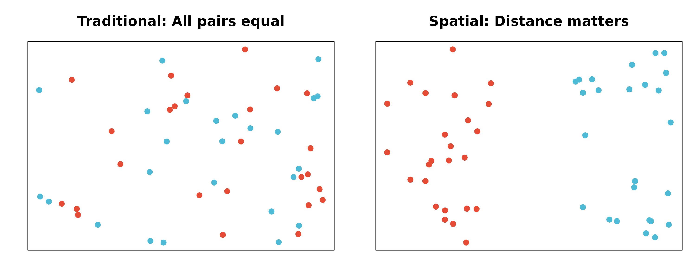

# Spatial Transcriptomics Analysis

## Overview

scMetaLink supports **spatial transcriptomics** data, enabling the
analysis of metabolite-mediated cell communication with spatial context.
This vignette demonstrates how to:

1.  Create a spatial scMetaLink object
2.  Compute spatially-weighted communication
3.  Visualize communication patterns on tissue coordinates
4.  Identify communication hotspots

## Spatial Analysis Workflow

The following diagram illustrates the complete spatial transcriptomics
analysis workflow in scMetaLink:


**Figure 1: Spatial scMetaLink Workflow.** Overview of the spatial
transcriptomics analysis pipeline, from data input through
spatially-weighted communication inference to visualization.

## Spatial Communication Algorithm

scMetaLink incorporates spatial distance to weight cell-cell
communication. The computational framework is illustrated below:


**Figure 2: Spatial Communication Algorithm.** Mathematical framework
showing how spatial distances are incorporated into metabolite
production, sensing, and communication score calculations.

## Why Spatial Analysis?

Traditional single-cell analysis treats cells as independent units,
ignoring their physical locations. However, metabolite signaling is
fundamentally spatial:

- **Metabolites diffuse** through tissue with distance-dependent decay
- **Nearby cells** are more likely to communicate via metabolites
- **Spatial organization** of cell types affects signaling patterns

scMetaLink’s spatial module incorporates these biological realities.



## Load Example Data

scMetaLink includes a colon spatial transcriptomics dataset for
demonstration.

``` r
library(scMetaLink)
library(Matrix)

# Load spatial colon data
data(st_expr)
data(st_meta)
data(st_scalefactors)

# Check the data
cat("=== Spatial Transcriptomics Data ===\n")
#> === Spatial Transcriptomics Data ===
cat("Expression matrix:", dim(st_expr)[1], "genes x", dim(st_expr)[2], "spots\n")
#> Expression matrix: 4284 genes x 1000 spots
cat("\nSpot metadata:\n")
#> 
#> Spot metadata:
head(st_meta)
#>                        x     y array_row array_col   cell_type
#> TAGTCCCGGAGACCAC-1  6642 13195        66        48 Endothelial
#> GTGCGTGTATATGAGC-1 10097  8796        41        83     Stromal
#> CCGGTATCTGGCGACT-1 10371 15069        77        85  Fibroblast
#> CCCAAGAATGCACGGT-1 10519  1993         2        88      Immune
#> CGAAACATAGATGGCA-1  9435  3574        11        77      Immune
#> TTCTTATCCGCTGGGT-1 11917 10169        49       101  Fibroblast

cat("\nCell type distribution:\n")
#> 
#> Cell type distribution:
print(table(st_meta$cell_type))
#> 
#> Endothelial  Epithelial  Fibroblast      Immune     Stromal       Tumor 
#>         174         189         232         145         133         127

cat("\nScale factors:\n")
#> 
#> Scale factors:
print(st_scalefactors)
#> $spot_diameter_fullres
#> [1] 130.2321
#> 
#> $tissue_hires_scalef
#> [1] 0.1220703
#> 
#> $tissue_lowres_scalef
#> [1] 0.03662109
#> 
#> $spot_diameter_um
#> [1] 55
#> 
#> $pixels_per_um
#> [1] 2.367856
```

## Create Spatial scMetaLink Object

Use
[`createScMetaLinkFromSpatial()`](https://Zaoqu-Liu.github.io/scMetaLink/reference/createScMetaLinkFromSpatial.md)
to create an object with spatial coordinates.

``` r
# Create spatial scMetaLink object
obj <- createScMetaLinkFromSpatial(
  expression_data = st_expr,
  spatial_coords = st_meta[, c("x", "y")],
  cell_meta = st_meta,
  cell_type_column = "cell_type",
  scale_factors = st_scalefactors,  # Important for correct distance calculation!
  min_cells = 5
)

# Check the object
obj
#> scMetaLink Object
#> =================
#> Genes: 4284
#> Cells: 1000
#> Cell types: 6 (Endothelial, Stromal, Fibroblast, ...)
```

### Important: Coordinate Units

For **10x Visium** data:

- Raw coordinates are in **pixels**, not micrometers
- You **must** provide `scale_factors` with `pixels_per_um` for correct
  distance calculations
- Without proper scaling, distance parameters (sigma, threshold) will be
  interpreted as pixels!

``` r
# Check spatial distance statistics
dist_stats <- getSpatialDistanceStats(obj)

cat("=== Spatial Distance Statistics ===\n")
#> === Spatial Distance Statistics ===
cat("Number of spots:", dist_stats$n_spots, "\n")
#> Number of spots: 1000
cat("Min distance:", round(dist_stats$min_distance_um, 1), "um\n")
#> Min distance: 84.5 um
cat("Median distance:", round(dist_stats$median_distance_um, 1), "um\n")
#> Median distance: 2558.5 um
cat("Max distance:", round(dist_stats$max_distance_um, 1), "um\n")
#> Max distance: 6864.2 um
cat("Coordinate unit:", dist_stats$coord_unit, "\n")
#> Coordinate unit: converted to micrometers
```

### Working with Seurat Objects

If you have a Seurat spatial object, use
[`createScMetaLinkFromSeuratSpatial()`](https://Zaoqu-Liu.github.io/scMetaLink/reference/createScMetaLinkFromSeuratSpatial.md):

``` r
# From Seurat spatial object
obj <- createScMetaLinkFromSeuratSpatial(
  seurat_obj = seurat_spatial,
  cell_type_column = "cell_type",  # Column with deconvolution results
  assay = "Spatial",
  image = "slice1"  # Name of the spatial image
)
```

## Visualize Spatial Cell Types

Before analysis, visualize the spatial distribution of cell types.

``` r
plotSpatialCellTypes(obj, point_size = 2, alpha = 0.8)
```


**Figure 3: Spatial Cell Type Distribution.** Each spot is colored by
its assigned cell type. For Visium data, cell types typically come from
deconvolution methods (RCTD, cell2location, etc.).

## Infer Production and Sensing

Run the standard production and sensing inference.

``` r
# Infer metabolite production
obj <- inferProduction(
  obj,
  method = "combined",
  consider_degradation = TRUE,
  consider_secretion = TRUE,
  verbose = TRUE
)

# Infer metabolite sensing
obj <- inferSensing(
  obj,
  method = "combined",
  weight_by_affinity = TRUE,
  include_transporters = TRUE,
  verbose = TRUE
)
```

## Visualize Spatial Metabolite Patterns

Visualize production and sensing scores on spatial coordinates.

``` r
plotSpatialFeature(
  obj,
  metabolite = "L-Lactic acid",
  type = "production",
  point_size = 2
)
```


**Figure 4: Lactate Production Potential.** Spots are colored by lactate
production score based on their cell type. Warmer colors indicate higher
production potential.

``` r
plotSpatialFeature(
  obj,
  metabolite = "L-Lactic acid",
  type = "sensing",
  point_size = 2,
  low_color = "#EBF5FB",
  high_color = "#1A5276"
)
```


**Figure 5: Lactate Sensing Capability.** Spots are colored by lactate
sensing score. This shows which regions can detect and respond to
lactate signaling.

### Compare Multiple Metabolites

``` r
plotSpatialComparison(
  obj,
  metabolites = c("L-Lactic acid", "L-Glutamic acid", "Adenosine", "L-Alanine"),
  type = "production",
  ncol = 2,
  point_size = 1.5
)
```


**Figure 6: Spatial Comparison of Key Metabolites.** Production patterns
for multiple metabolites shown side by side, revealing distinct spatial
organization of metabolic activities.

## Compute Spatial Communication

The key innovation is **spatially-weighted communication**. Nearby cell
type pairs receive higher communication scores.

### Spatial Weighting Methods

scMetaLink offers several spatial weighting methods:

| Method        | Formula                              | Best for              |
|---------------|--------------------------------------|-----------------------|
| `knn`         | K-nearest neighbors only             | Visium (recommended)  |
| `gaussian`    | $e^{- d^{2}/2\sigma^{2}}$            | Smooth decay          |
| `exponential` | $e^{- d/\lambda}$                    | Sharp decay           |
| `linear`      | $\max\left( 0,1 - d/d_{max} \right)$ | Simple model          |
| `threshold`   | Binary cutoff                        | Strict distance limit |


**Figure 7: Spatial Weighting Functions.** Different methods model the
decay of communication potential with distance. KNN (not shown) uses a
binary approach based on nearest neighbors.

### Run Spatial Communication Analysis

For **Visium data**, we recommend the `knn` method with k=6 (hexagonal
grid neighbors):

``` r
# Compute spatially-weighted communication
obj <- computeSpatialCommunication(
  obj,
  method = "knn",           # K-nearest neighbors (recommended for Visium)
  k_neighbors = 6,          # 6 neighbors for hexagonal grid
  symmetric = TRUE,         # Bidirectional communication potential
  comm_method = "geometric", # sqrt(production x sensing)
  min_production = 0.1,
  min_sensing = 0.1,
  n_permutations = 100,     # Use >=1000 for publication
  n_cores = 1,
  seed = 42,
  verbose = TRUE
)
#>   |                                                                              |                                                                      |   0%  |                                                                              |=                                                                     |   1%  |                                                                              |=                                                                     |   2%  |                                                                              |==                                                                    |   3%  |                                                                              |===                                                                   |   4%  |                                                                              |====                                                                  |   5%  |                                                                              |====                                                                  |   6%  |                                                                              |=====                                                                 |   7%  |                                                                              |======                                                                |   8%  |                                                                              |======                                                                |   9%  |                                                                              |=======                                                               |  10%  |                                                                              |========                                                              |  11%  |                                                                              |========                                                              |  12%  |                                                                              |=========                                                             |  13%  |                                                                              |==========                                                            |  14%  |                                                                              |==========                                                            |  15%  |                                                                              |===========                                                           |  16%  |                                                                              |============                                                          |  17%  |                                                                              |=============                                                         |  18%  |                                                                              |=============                                                         |  19%  |                                                                              |==============                                                        |  20%  |                                                                              |===============                                                       |  21%  |                                                                              |===============                                                       |  22%  |                                                                              |================                                                      |  23%  |                                                                              |=================                                                     |  24%  |                                                                              |==================                                                    |  25%  |                                                                              |==================                                                    |  26%  |                                                                              |===================                                                   |  27%  |                                                                              |====================                                                  |  28%  |                                                                              |====================                                                  |  29%  |                                                                              |=====================                                                 |  30%  |                                                                              |======================                                                |  31%  |                                                                              |======================                                                |  32%  |                                                                              |=======================                                               |  33%  |                                                                              |========================                                              |  34%  |                                                                              |========================                                              |  35%  |                                                                              |=========================                                             |  36%  |                                                                              |==========================                                            |  37%  |                                                                              |===========================                                           |  38%  |                                                                              |===========================                                           |  39%  |                                                                              |============================                                          |  40%  |                                                                              |=============================                                         |  41%  |                                                                              |=============================                                         |  42%  |                                                                              |==============================                                        |  43%  |                                                                              |===============================                                       |  44%  |                                                                              |================================                                      |  45%  |                                                                              |================================                                      |  46%  |                                                                              |=================================                                     |  47%  |                                                                              |==================================                                    |  48%  |                                                                              |==================================                                    |  49%  |                                                                              |===================================                                   |  50%  |                                                                              |====================================                                  |  51%  |                                                                              |====================================                                  |  52%  |                                                                              |=====================================                                 |  53%  |                                                                              |======================================                                |  54%  |                                                                              |======================================                                |  55%  |                                                                              |=======================================                               |  56%  |                                                                              |========================================                              |  57%  |                                                                              |=========================================                             |  58%  |                                                                              |=========================================                             |  59%  |                                                                              |==========================================                            |  60%  |                                                                              |===========================================                           |  61%  |                                                                              |===========================================                           |  62%  |                                                                              |============================================                          |  63%  |                                                                              |=============================================                         |  64%  |                                                                              |==============================================                        |  65%  |                                                                              |==============================================                        |  66%  |                                                                              |===============================================                       |  67%  |                                                                              |================================================                      |  68%  |                                                                              |================================================                      |  69%  |                                                                              |=================================================                     |  70%  |                                                                              |==================================================                    |  71%  |                                                                              |==================================================                    |  72%  |                                                                              |===================================================                   |  73%  |                                                                              |====================================================                  |  74%  |                                                                              |====================================================                  |  75%  |                                                                              |=====================================================                 |  76%  |                                                                              |======================================================                |  77%  |                                                                              |=======================================================               |  78%  |                                                                              |=======================================================               |  79%  |                                                                              |========================================================              |  80%  |                                                                              |=========================================================             |  81%  |                                                                              |=========================================================             |  82%  |                                                                              |==========================================================            |  83%  |                                                                              |===========================================================           |  84%  |                                                                              |============================================================          |  85%  |                                                                              |============================================================          |  86%  |                                                                              |=============================================================         |  87%  |                                                                              |==============================================================        |  88%  |                                                                              |==============================================================        |  89%  |                                                                              |===============================================================       |  90%  |                                                                              |================================================================      |  91%  |                                                                              |================================================================      |  92%  |                                                                              |=================================================================     |  93%  |                                                                              |==================================================================    |  94%  |                                                                              |==================================================================    |  95%  |                                                                              |===================================================================   |  96%  |                                                                              |====================================================================  |  97%  |                                                                              |===================================================================== |  98%  |                                                                              |===================================================================== |  99%  |                                                                              |======================================================================| 100%
```

### Alternative: Gaussian Decay

For more continuous distance weighting:

``` r
obj <- computeSpatialCommunication(
  obj,
  method = "gaussian",
  sigma = 50,               # 50 um characteristic decay
  distance_threshold = 150, # Max communication distance
  n_permutations = 100,
  verbose = TRUE
)
```

## Filter Significant Interactions

``` r
# Filter significant spatial interactions
obj <- filterSignificantInteractions(
  obj,
  pvalue_threshold = 0.05,
  adjust_method = "none"  # Use "BH" for real analysis with more permutations
)

# View results
cat("Significant spatial interactions:", nrow(obj@significant_interactions), "\n\n")
#> Significant spatial interactions: 442
head(obj@significant_interactions[, c("sender", "receiver", "metabolite_name",
                                       "communication_score", "pvalue_adjusted")])
#>       sender   receiver                 metabolite_name communication_score
#> 1    Stromal Fibroblast               Prostaglandin F1a           0.9781756
#> 2    Stromal    Stromal 20-Hydroxyeicosatetraenoic acid           0.9716861
#> 3 Fibroblast    Stromal       DG(18:0/18:2(9Z,12Z)/0:0)           0.9605915
#> 4    Stromal    Stromal                Prostaglandin I2           0.9602908
#> 5 Fibroblast    Stromal                         Retinal           0.9583222
#> 6 Fibroblast    Stromal               DG(18:0/18:0/0:0)           0.9579443
#>   pvalue_adjusted
#> 1      0.00990099
#> 2      0.00990099
#> 3      0.00990099
#> 4      0.01980198
#> 5      0.00990099
#> 6      0.00990099
```

## Visualize Spatial Communication Network

``` r
plotSpatialCommunicationNetwork(
  obj,
  metabolite = NULL,  # Aggregate all metabolites
  top_n = 15,
  arrow_scale = 1.5,
  point_size = 6,
  show_labels = TRUE
)
```


**Figure 8: Spatial Communication Network.** Arrows connect cell type
centroids, with width proportional to communication strength. Background
spots show the tissue context.

### Metabolite-Specific Network

``` r
plotSpatialCommunicationNetwork(
  obj,
  metabolite = "L-Lactic acid",
  top_n = 10,
  arrow_scale = 2,
  point_size = 6
)
```


**Figure 9: Lactate Communication Network.** Spatial communication
pattern for lactate specifically, showing which cell types communicate
via this metabolite.

## Analyze Communication Patterns

### Top Spatial Interactions

``` r
sig <- obj@significant_interactions

# Top metabolites in spatial communication
cat("=== Top Metabolite Mediators (Spatial) ===\n")
#> === Top Metabolite Mediators (Spatial) ===
met_counts <- table(sig$metabolite_name)
print(head(sort(met_counts, decreasing = TRUE), 15))
#> 
#>                          24-Hydroxycholesterol 
#>                                              5 
#>               DG(18:0/20:4(5Z,8Z,11Z,14Z)/0:0) 
#>                                              5 
#>                                    Epinephrine 
#>                                              5 
#>                                L-Aspartic acid 
#>                                              5 
#>                               Prostaglandin D2 
#>                                              5 
#>                               Prostaglandin E2 
#>                                              5 
#>                                      Adenosine 
#>                                              4 
#>                             Pentadecanoic acid 
#>                                              4 
#>                           13-cis-Retinoic acid 
#>                                              3 
#>                                        13-HODE 
#>                                              3 
#>                 17-Hydroxypregnenolone sulfate 
#>                                              3 
#>                        17a-Hydroxypregnenolone 
#>                                              3 
#> 3 alpha,7 alpha,26-Trihydroxy-5beta-cholestane 
#>                                              3 
#>                          3-Hydroxybutyric acid 
#>                                              3 
#>                                         5-HETE 
#>                                              3
```

### Cell Type Communication Summary

``` r
par(mfrow = c(1, 2))

# Outgoing (sender) strength
outgoing <- aggregate(communication_score ~ sender, data = sig, FUN = sum)
outgoing <- outgoing[order(-outgoing$communication_score), ]
barplot(outgoing$communication_score, names.arg = outgoing$sender,
        las = 2, col = "#E64B35", main = "Outgoing Spatial Communication")

# Incoming (receiver) strength
incoming <- aggregate(communication_score ~ receiver, data = sig, FUN = sum)
incoming <- incoming[order(-incoming$communication_score), ]
barplot(incoming$communication_score, names.arg = incoming$receiver,
        las = 2, col = "#4DBBD5", main = "Incoming Spatial Communication")
```


``` r

par(mfrow = c(1, 1))
```

## Communication Hotspot Identification

For spot-level analysis, scMetaLink can identify spatial hotspots of
communication activity.

``` r
# Note: Requires running computeSpatialCommunication with analysis_level="spot"
obj_spot <- computeSpatialCommunication(
  obj,
  method = "knn",
  k_neighbors = 6,
  analysis_level = "spot",  # Spot-level analysis
  n_permutations = 0,       # Skip permutation for speed
  verbose = TRUE
)

# Identify hotspots
hotspots <- identifyCommunicationHotspots(
  obj_spot,
  metabolite = "L-Lactic acid",
  type = "sender",
  n_hotspots = 5
)

print(hotspots)

# Visualize hotspots
plotSpatialHotspots(obj_spot, metabolite = "L-Lactic acid", type = "sender")
```

## Spatial Distance Distribution

Understand the spatial relationships in your data:

``` r
plotSpatialDistanceDistribution(obj, max_distance = 1000, bins = 50)
```


**Figure 10: Spatial Distance Distribution.** Histogram showing the
distribution of pairwise distances between spots. Red lines mark common
distance thresholds (100, 200, 500 um).

## Parameter Guidelines

### Distance Thresholds by Metabolite Type

| Metabolite Category | Typical Range | Recommended sigma |
|---------------------|---------------|-------------------|
| ATP, Adenosine      | 20-50 um      | 20-30 um          |
| Lactate             | 50-100 um     | 50-80 um          |
| Amino acids         | 80-150 um     | 80-120 um         |
| Lipid mediators     | 100-200 um    | 100-150 um        |

### Platform-Specific Recommendations

| Platform   | Spot Size   | Spacing  | Recommended Method     |
|------------|-------------|----------|------------------------|
| 10x Visium | 55 um       | ~100 um  | knn (k=6)              |
| Slide-seq  | 10 um       | ~10 um   | gaussian (sigma=30)    |
| MERFISH    | subcellular | variable | gaussian (sigma=10-20) |
| Stereo-seq | 0.5 um      | variable | knn or gaussian        |

## Complete Workflow Example

``` r
# Complete spatial analysis workflow
library(scMetaLink)

# 1. Load data
data(st_expr)
data(st_meta)
data(st_scalefactors)

# 2. Create spatial object
obj <- createScMetaLinkFromSpatial(
  expression_data = st_expr,
  spatial_coords = st_meta[, c("x", "y")],
  cell_meta = st_meta,
  cell_type_column = "cell_type",
  scale_factors = st_scalefactors
)

# 3. Infer production and sensing
obj <- inferProduction(obj)
obj <- inferSensing(obj)

# 4. Compute spatial communication
obj <- computeSpatialCommunication(
  obj,
  method = "knn",
  k_neighbors = 6,
  n_permutations = 1000  # More permutations for publication
)

# 5. Filter significant interactions
obj <- filterSignificantInteractions(obj, adjust_method = "BH")

# 6. Visualize results
plotSpatialCellTypes(obj)
plotSpatialCommunicationNetwork(obj)

# 7. Export results
exportResults(obj, output_dir = "spatial_results")
```

## Key Differences from Non-Spatial Analysis

| Aspect                  | Non-Spatial             | Spatial                         |
|-------------------------|-------------------------|---------------------------------|
| **Cell relationships**  | All pairs equal         | Distance-weighted               |
| **Communication score** | $\sqrt{P \times S}$     | $\sqrt{P \times S} \times w(d)$ |
| **Visualization**       | Network/heatmap         | Tissue coordinates              |
| **Biological meaning**  | Potential communication | Likely communication            |

## Limitations and Considerations

1.  **Resolution**: Visium spots contain multiple cells; cell type
    assignments are approximations
2.  **Deconvolution**: Use proper deconvolution methods (RCTD,
    cell2location) for cell type assignment
3.  **Diffusion assumptions**: Metabolite diffusion is simplified as
    distance-dependent decay
4.  **3D tissue**: Current analysis is 2D; vertical diffusion is not
    modeled

## Session Info

``` r
sessionInfo()
#> R version 4.5.2 (2025-10-31)
#> Platform: x86_64-pc-linux-gnu
#> Running under: Ubuntu 24.04.3 LTS
#> 
#> Matrix products: default
#> BLAS:   /usr/lib/x86_64-linux-gnu/openblas-pthread/libblas.so.3 
#> LAPACK: /usr/lib/x86_64-linux-gnu/openblas-pthread/libopenblasp-r0.3.26.so;  LAPACK version 3.12.0
#> 
#> locale:
#>  [1] LC_CTYPE=C.UTF-8       LC_NUMERIC=C           LC_TIME=C.UTF-8       
#>  [4] LC_COLLATE=C.UTF-8     LC_MONETARY=C.UTF-8    LC_MESSAGES=C.UTF-8   
#>  [7] LC_PAPER=C.UTF-8       LC_NAME=C              LC_ADDRESS=C          
#> [10] LC_TELEPHONE=C         LC_MEASUREMENT=C.UTF-8 LC_IDENTIFICATION=C   
#> 
#> time zone: UTC
#> tzcode source: system (glibc)
#> 
#> attached base packages:
#> [1] stats     graphics  grDevices utils     datasets  methods   base     
#> 
#> other attached packages:
#> [1] Matrix_1.7-4     scMetaLink_1.0.0
#> 
#> loaded via a namespace (and not attached):
#>  [1] gtable_0.3.6       jsonlite_2.0.0     dplyr_1.1.4        compiler_4.5.2    
#>  [5] tidyselect_1.2.1   jquerylib_0.1.4    systemfonts_1.3.1  scales_1.4.0      
#>  [9] textshaping_1.0.4  yaml_2.3.12        fastmap_1.2.0      lattice_0.22-7    
#> [13] ggplot2_4.0.1      R6_2.6.1           labeling_0.4.3     generics_0.1.4    
#> [17] knitr_1.51         htmlwidgets_1.6.4  tibble_3.3.1       desc_1.4.3        
#> [21] bslib_0.9.0        pillar_1.11.1      RColorBrewer_1.1-3 rlang_1.1.7       
#> [25] cachem_1.1.0       xfun_0.56          fs_1.6.6           sass_0.4.10       
#> [29] S7_0.2.1           otel_0.2.0         cli_3.6.5          withr_3.0.2       
#> [33] pkgdown_2.2.0      magrittr_2.0.4     digest_0.6.39      grid_4.5.2        
#> [37] lifecycle_1.0.5    vctrs_0.7.0        evaluate_1.0.5     glue_1.8.0        
#> [41] farver_2.1.2       ragg_1.5.0         rmarkdown_2.30     tools_4.5.2       
#> [45] pkgconfig_2.0.3    htmltools_0.5.9
```
