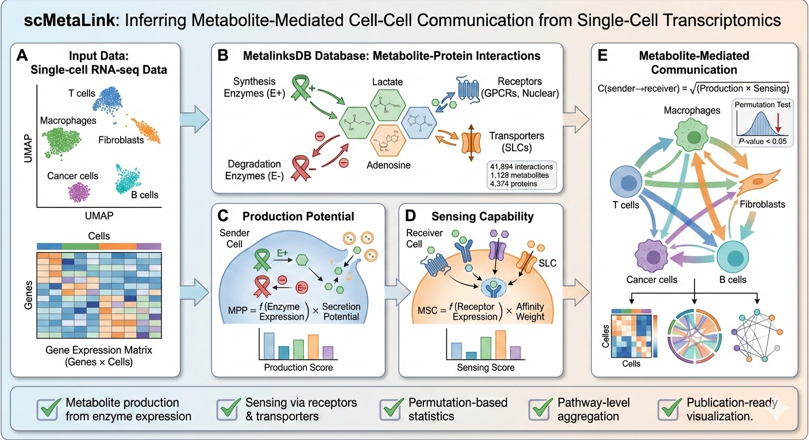

```{r setup, include=FALSE}
knitr::opts_chunk$set(
  collapse = TRUE,
  comment = "#>",
  fig.width = 8,
  fig.height = 6,
  fig.align = "center",
  out.width = "100%",
  dpi = 150,
  warning = FALSE,
  message = FALSE
)
```

## Introduction

**scMetaLink** infers metabolite-mediated cell-cell communication from single-cell RNA-seq data. Unlike traditional ligand-receptor analysis, scMetaLink focuses on metabolites as signaling mediators, capturing a crucial but often overlooked layer of intercellular communication.

```{r flowchart, echo=FALSE, out.width="100%", fig.cap="**Figure 1: scMetaLink Workflow.** Overview of the scMetaLink analysis pipeline."}

```

### What You'll Learn

1. How to set up a scMetaLink analysis
2. The basic workflow from data input to results
3. How to interpret the main outputs

## Installation

```{r install, eval=FALSE}
# Install from GitHub
devtools::install_github("Zaoqu-Liu/scMetaLink")
```

## Load Package and Example Data

```{r load}
library(scMetaLink)
library(Matrix)

# Load built-in colorectal cancer example data
data(crc_example)

# Check the data structure
cat("Expression matrix dimensions:", dim(crc_expr), "\n")
cat("Genes:", nrow(crc_expr), "| Cells:", ncol(crc_expr), "\n")
cat("\nCell metadata:\n")
head(crc_meta)
cat("\nCell type distribution:\n")
print(table(crc_meta$cell_type))
```

## The 5-Minute Workflow

### Step 1: Create scMetaLink Object

```{r create}
# Create the analysis object
obj <- createScMetaLink(
  expression_data = crc_expr,
  cell_meta = crc_meta,
  cell_type_column = "cell_type"
)

# Check the object
obj
```

### Step 2: Infer Metabolite Production

Production potential reflects how capable each cell type is at **synthesizing and secreting** specific metabolites.

```{r production}
obj <- inferProduction(
  obj,
  method = "combined", # Use mean expression x proportion expressing
  consider_degradation = TRUE, # Subtract degradation enzyme expression
  consider_secretion = TRUE, # Weight by secretion potential
  verbose = TRUE
)

# View top lactate producers
getTopProducers(obj, "L-Lactic acid", top_n = 5)
```

### Step 3: Infer Metabolite Sensing

Sensing capability reflects how capable each cell type is at **detecting and responding to** specific metabolites.

```{r sensing}
obj <- inferSensing(
  obj,
  method = "combined",
  weight_by_affinity = TRUE, # Weight by receptor-metabolite affinity
  include_transporters = TRUE, # Include uptake transporters
  verbose = TRUE
)

# View top glutamate sensors
getTopSensors(obj, "L-Glutamic acid", top_n = 5)
```

### Step 4: Compute Communication

Communication scores quantify the potential signal flow from sender (producer) to receiver (sensor) cells.

```{r communication}
obj <- computeCommunication(
  obj,
  method = "geometric", # sqrt(production x sensing)
  min_production = 0.1, # Filter weak producers
  min_sensing = 0.1, # Filter weak sensors
  n_permutations = 100, # Permutation test for significance
  verbose = TRUE
)
```

### Step 5: Filter Significant Interactions

```{r filter}
# For this quick tutorial with limited permutations, we use no adjustment
# In real analysis with more permutations, use adjust_method = "BH"
obj <- filterSignificantInteractions(
  obj,
  pvalue_threshold = 0.05,
  adjust_method = "none" # Use "BH" for real analysis
)

# View top significant interactions
head(obj@significant_interactions, 10)
```

## Quick Visualization

### Communication Heatmap

The heatmap shows pairwise communication strength between cell types, aggregated across all significant metabolites.

```{r heatmap, fig.height=7, fig.width=8, fig.cap="**Figure 1: Communication Heatmap.** Each cell shows the total communication score from sender (rows) to receiver (columns) cell types. Darker colors indicate stronger communication."}
plotCommunicationHeatmap(obj)
```

### Chord Diagram

The chord diagram provides an intuitive view of communication flow between cell types.

```{r chord, fig.height=8, fig.width=8, fig.cap="**Figure 2: Communication Chord Diagram.** Ribbons connect sender to receiver cell types, with width proportional to communication strength. Colors represent sender cell types."}
plotCommunicationCircle(obj, top_n = 50)
```

## One-Line Workflow

For convenience, you can run the entire analysis with a single function:

```{r workflow, eval=FALSE}
# Complete analysis in one line
obj <- runScMetaLink(
  expression_data = crc_expr,
  cell_meta = crc_meta,
  cell_type_column = "cell_type",
  n_permutations = 100
)
```

## Understanding the Output

### Key Objects in the Result

| Slot | Description |
|------|-------------|
| `@production_scores` | Matrix: metabolites x cell types, production potential |
| `@sensing_scores` | Matrix: metabolites x cell types, sensing capability |
| `@communication_scores` | 3D array: sender x receiver x metabolite |
| `@communication_pvalues` | 3D array: permutation p-values |
| `@significant_interactions` | data.frame: filtered significant interactions |

### Accessing Results

```{r access}
# Production scores (first 5 metabolites, first 5 cell types)
obj@production_scores[1:5, 1:5]

# Significant interactions summary
cat("Total significant interactions:", nrow(obj@significant_interactions), "\n")
cat("\nTop metabolites involved:\n")
print(head(sort(table(obj@significant_interactions$metabolite_name), decreasing = TRUE), 10))
```

## Export Results

```{r export, eval=FALSE}
# Export all results to files
exportResults(obj, output_dir = "scMetaLink_results")
```

## Next Steps

- **[Theory & Methods](theory.html)**: Understand the mathematical framework
- **[Production & Sensing](production-sensing.html)**: Deep dive into inference
- **[Communication Analysis](communication.html)**: Advanced communication analysis
- **[Spatial Analysis](spatial-analysis.html)**: Spatial transcriptomics support
- **[Visualization](visualization.html)**: Complete visualization guide
- **[Applications](applications.html)**: Real-world analysis examples

## Session Info

```{r session}
sessionInfo()
```
